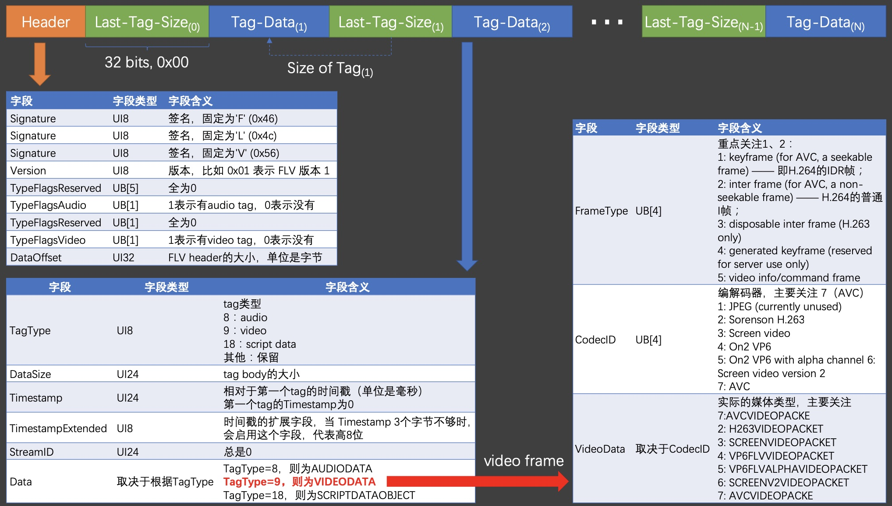

# 视频格式

平时生活中，我们经常会看到电影文件以 `mp4`/`rmvb`/`mov`/`flv`/`ts` 等结尾，也常谈论一个视频是不是 `1080P`/`4k`/`蓝光` 的清晰度，甚至一些电影发烧友还会关注资源是无损还是有损压缩，是不是采用 `H.264`/`H.265`/`MPEG-4` 等编码方式。

上面谈到的这些，其实对应一个视频文件需要关注的三个方面：

1. 视频封装格式
2. 视频的分辨率
3. 视频编码方式

那么这些具体是指什么呢？ 为什么每一个方面有这么多不同的类别呢？

## 封装格式

虽然有各种各样的封装格式，但是均由下面几个部分组成：

- `metadata`: 元信息，包含了视频的概要信息：
  - 总时长
  - 比特率（bit-rate，即视频在一秒内的数据量）
  - 关键帧（key-frame，方便播放器进行快速定位到指定时间点）
  - ...
- `video codec format`: 视频编解码器的格式
- `audio codec formt`: 音频编解码器的格式
- `subtitle format`: 字幕格式

> codec: 是 **co**mpress/**dec**ompress 的缩写，表示编解码的意思。

不同的封装格式主要是对这些信息的组织方式不同，这里以 `mp4` 和 `flv` 来做个例子进行对比。

mp4 封装格式类似于俄罗斯套娃，通过一层一层的 Atom（也叫 Box）嵌套，表达能力很强，易于扩展：


flv（即 Flash Video）是由 Adobe 公司推出的一种封装格式，它的结构相较于 mp4 而言非常简单，也正是得益于它的封装简单，所以得到的音视频文件相对而言体积小一点点。



那么为什么需要这么多不同的封装格式呢？ 一方面是因为不同的封装方式各有特点，适用于不同的场所，例如 `ts` 封装文件就很适合流媒体，另一方面则是因为商业的因素，不同的封装方式背后都有公司/协会的支持，代表着相应的生态和产业链，是巨大的利益。

由于封装格式只是对视频信息的组织方式不同，和视频本身的编码并不相关，所以在不同的视频文件之间可以无损转换。例如，可以通过下列命令将 `test.mp4` 文件转换为 `test.flv` 文件:

```shell
ffmpeg -i test.mp4 -c:v copy -c:a copy test.flv
```

## 编码方式

音视频采用的编码方式、压缩参数最终决定了我们观看的质量。一般而言，音视频的编码方式随着时间的发展，可以在尽量不影响视频质量的情况下，提高视频的压缩率，我们常用的编码方式有以下几种：

- 视频编码
  - MPEG-1（VCD 编码方式）
  - MPEG-2（DVD 编码方式）
  - MPEG-4（压缩比获得极大提升）
  - H.264
  - H.265
- 音频编码
  - AAC
  - AC-3
  - MP3
  - WMA

不同编码方式内部的压缩算法这里就不讲了，说一说视频编码背后的两个组织吧:

- MPEG（Moving Picture Experts Group），即动态影像专家小组，是来自自ISO与IEC等国际组织的工作小组，用以制定影音压缩及传输的规格标准，他们推出了 MPEG-1/MPEG-2/MPEG-4 等标准。
- ITU-T（ITU Telecommunication Standardization Sector），即国际电信联盟远程通信标准化组织，他们退出了 H.261/H.262/H.263/H.264 等标准。

俗话说的好，分久必合。MPEG 和 ITU-T 联合推出了 H.264，它也是 MPEG-4 的第十部分，目前它已成为最常用的编码方式

## 分辨率

视频的分辨率指的是画面中所包含的像素点数，我们常说的分辨率有：

- 720p
- 1080i（i 表示 interlaced scan，也就是隔行扫描，数据量更小，但是图像不够平滑，不适合运动类型的视频）
- 1080p（p 表示 progressive scanning，也就是逐行扫描）
- 2k
- 4k

那是不是视频的分辨率越高越清晰呢？

也不一定，还取决于播放设备、视频的帧率等，例如将 4k 的视频放在 1080p 的显示器上播放，也不会达到非常清晰的效果。

<Vssue title="视频格式" />
