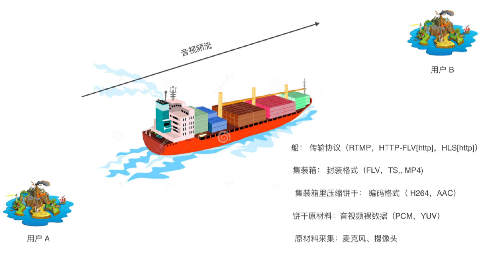
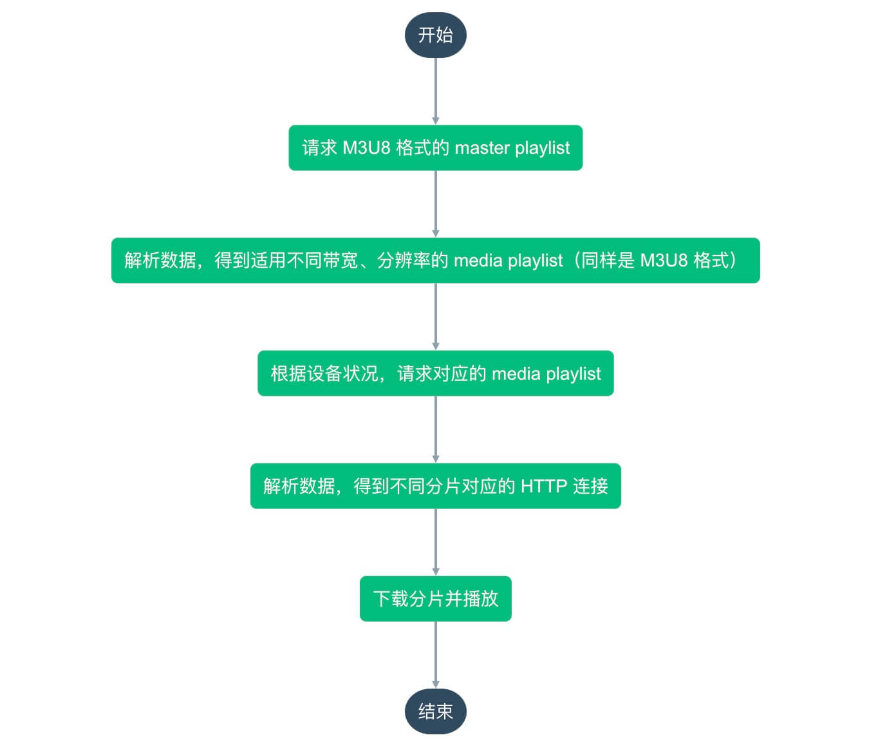

# 传输协议

在零几年的时候，想要看视频往往需要先将视频文件完整地下载到本地，然后再进行播放。经过了十多年的时间，如今已经可以在线直接播放视频，而且能随意拖曳进度条，这样的变化多亏于音视频背后传输协议的演变。

视频的封装协议决定了音视频信息的组织方式，视频的传输协议则决定了这些信息如何从服务器端传输到客户端。就例如下图中，封装格式就类似于集装箱般组织数据，而传输协议则就像船一样，负责将数据传输给用户。



视频播放主要分为点播和直播两个场景，不同的场景适用不同的传输协议，不过有些协议也可以同时应用于两个场景值，我们先通过表格来整体看一下：

|                | HTTP 渐进式下载              | HLS                                                 | HTTP-FLV                                 | RTMP                                | webRTC                              |
| :------------: | ---------------------------- | --------------------------------------------------- | ---------------------------------------- | ----------------------------------- | ----------------------------------- |
|    适用场景    | 点播                         | 点播/直播                                           | 点播/直播                                | 直播                                | 直播                                |
|    简单介绍    | 过渡性方案，一边下载一边播放 | 将视频文件拆分成许多个小文件，然后通过 HTTP 传输    | 通过 JS 将 FLV 文件解析后喂给 video 标签 | Adobe 公司推出，依赖 Flash 进行播放 | 谷歌推出，原本用于小型会议 P2P 直播 |
|     传输层     | HTTP 长连接                  | HTTP 短连接                                         | HTTP 短连接                              | TCP 长连接                          | UDP                                 |
|    封装格式    | MP4                          | TS                                                  | FLV                                      | FLV                                 | RTP                                 |
|   实现复杂度   | 简单                         | 简单                                                | 简单                                     | 复杂                                | 复杂                                |
| 直播的启播延时 | -                            | 很长（10秒）                                        | 较低（2-5秒）                            | 低（1-2秒）                         | 较低（1秒内）                       |
|   客户端依赖   | 原生支持                     | iOS/Android 支持，PC 端部分浏览器需引入 hls.js 依赖 | 引入 flv.js 依赖                         | Flash                               | 有待提升                            |

由于我在腾讯课堂负责的是 HLS 点播相关的功能，所以接下来主要讲一讲 HLS 相关的知识。


## HLS

HLS 的全称是 HTTP Live Streaming，翻译下就是基于 HTTP 的流媒体传输协议，由苹果公司在 2009 年推出。

### 整体流程

服务器端提前将视频文件拆分成许多小片段（常称为切片，封装格式为 `ts`），并得到含有全部分片信息的 M3U8 文件，然后分发给 CDN 网络，最后通过 HTTP 协议传输给用户，因而架构上非常简便。

客户端在看视频的时候，会先请求 M3U8 文件，然后再根据网络状况、设备分辨率等来加载对应的视频切片，整体流程如下：



### M3U8 文件

这里谈到了两种用途的 M3U8 文件：

- `master playlist`：包含了适用于不同分辨率、不同带宽下的 `media playlist` 文件请求地址列表。
- `media playlist`：包含了一个视频文件中所有分片的请求地址列表。

首先来看一个 `master playlist` 的例子，分别在第 3、5、7 行，通过 `BANDWIDTH=399580,RESOLUTION=1136x480` 这种方式，指出了在不同带宽和分辨率下应该请求的 `media playlist` 地址。

``` txt {3,5,7}
#EXTM3U
#EXT-X-VERSION:3
#EXT-X-STREAM-INF:PROGRAM-ID=0,BANDWIDTH=399580,RESOLUTION=1136x480
xxxxxxxx(URL1)
#EXT-X-STREAM-INF:PROGRAM-ID=0,BANDWIDTH=707342,RESOLUTION=1706x720
yyyyyyyy(URL2)
#EXT-X-STREAM-INF:PROGRAM-ID=0,BANDWIDTH=1093740,RESOLUTION=2560x1080
zzzzzzzz(URL3)
```

接下来看看 `media playlist` 的例子，大体上它是一个接一个的分片地址组成的 M3U8 文件，例如 `v.f30742.ts?start=0&end=770991&type=mpegts`/`v.f30742.ts?start=770992&end=1297023&type=mpegts` 这样依次排列，然后再加上一些额外信息，在下面的例子中包含了以下的信息：

- `#EXT-X-VERSION:3`：表示至少应该用第三版 HLS 规范解析该文件。
- `#EXT-X-TARGETDURATION:10`：表示每一个分片的时长不超过 10 秒。
- `#EXT-X-MEDIA-SEQUENCE:0`：表示在分片地址列表中，第一个地址对应的分片序号为 0。
- `#EXT-X-KEY:METHOD=AES-128,URL="xxx"`：表示分片被 AES-128 加密，密钥需要从 `xxx` 地址去获得。
- `#EXTINF:10.000000`：表示下一个分片的时长是 10 秒。

::: tip
这些字段的含义都可以快速的在 [RFC 8216 - HTTP Live Streaming](https://tools.ietf.org/html/rfc8216#section-4.3.2.1) 中找到。
:::

```
#EXTM3U
#EXT-X-VERSION:3
#EXT-X-TARGETDURATION:10
#EXT-X-MEDIA-SEQUENCE:0
#EXT-X-KEY:METHOD=AES-128,URI="https://ke.qq.com/cgi-bin/qcloud/get_dk?edk=xxxxxxx",IV=0x00000000000000000000000000000000
#EXTINF:10.000000,
v.f30742.ts?start=0&end=770991&type=mpegts&us=4449635466523407452&t=5f44f0e4&sign=4e68d431d681968c833cb8a21c86c67f
#EXT-X-KEY:METHOD=AES-128,URI="https://ke.qq.com/cgi-bin/qcloud/get_dk?edk=xxxxxxx",IV=0x00000000000000000000000000000000
#EXTINF:10.000000,
v.f30742.ts?start=770992&end=1297023&type=mpegts&us=4449635466523407452&sign=4e68d431d681968c833cb8a21c86c67f&t=5f44f0e4

.....

#EXT-X-ENDLIST
```

正由于通过 M3U8 来进行视频信息的传递，所以它非常的灵活，不过也由于需要先请求 M3U8 文件，然后解析出分片地址，最后再去请求视频文件的分片，所以这种方式的启播延时也较长。


### Web 端实现

在 Android/iOS 设备及 PC 端的 Safari 浏览器上，已经原生支持 HLS。在 PC 端的其它浏览器上，需要引入 [hls.js](https://github.com/video-dev/hls.js/) 进行兼容，它通过 [MediaSource Extensions](https://w3c.github.io/media-source/)，将视频数据解析之后喂给 `<video>` 标签进行播放。

## 参考资料

1. [RFC 8216 - HTTP Live Streaming](https://tools.ietf.org/html/rfc8216#section-4.3.2.1)

<Vssue title="音视频传输协议" />
