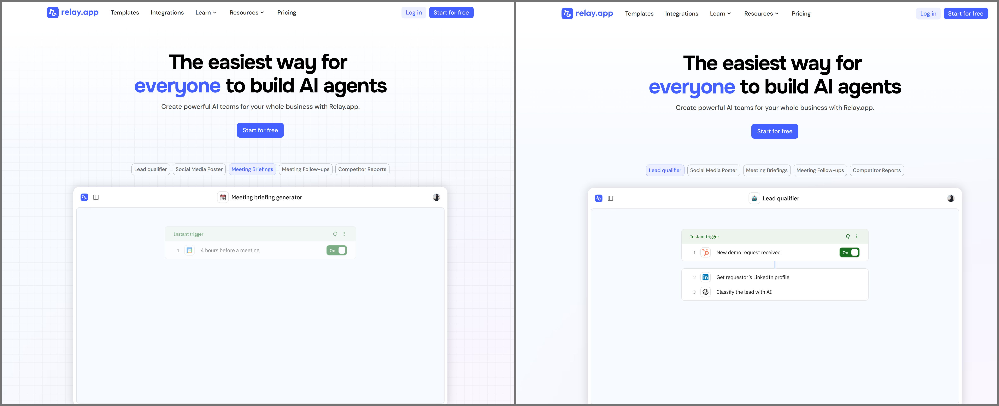
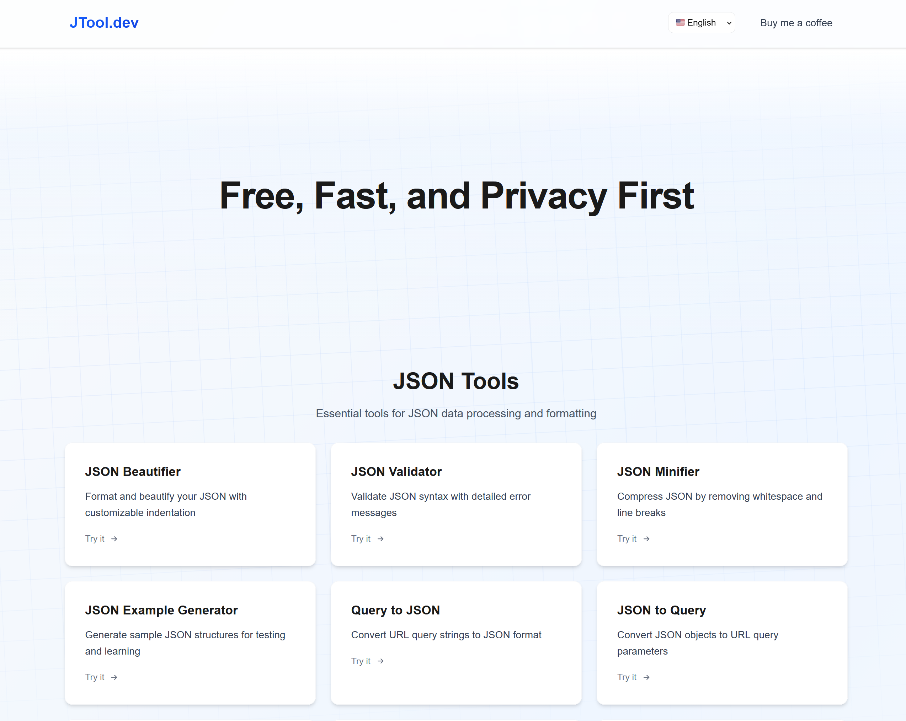

# 重复格子背景

最近发现不少开发类的网站都在首页使用上了重复格子的背景，例如下图中左侧以 [relay.app](https://www.relay.app/) 为例子的截图。

这种背景主要是为了在现在大量留白的设计风格下，避免页面过于空旷，增加一些视觉上的丰富性，不然就会如下图中右侧的截图那样在去掉背景后略显单调。



接下来具体讲一讲如何用 CSS 实现这种重复格子背景，主要有两种方法：

- 局部格子图片 + 背景重复
- CSS 渐变 + 背景重复（推荐）

## 方法一：局部格子图片 + 背景重复

[relay.app](https://www.relay.app/) 使用的就是这种方法，这应该是最常见也是最容易想到的方法，就是先准备一张格子图片，例如：


然后通过 `background` 相关属性进行设置即可，关键在于：

- `background-repeat` 需要设置为 `repeat`，保证图片的重复。
- `background-size` 可用于调整背景中格子的密度。

```css
background-image: url(https://framerusercontent.com/images/9c47fOR3CNoSsEtr6IEYJoKM.svg?width=126&height=126);
background-size: 63px auto;
background-repeat: repeat;
background-position: left top;
```

下面是一个 vue 组件使用后的效果示例：

<BoxBackgroundDemo defaultImplementation="svg" />

这个组件展示了格子背景重复的效果，你可以通过滑块调整 `background-size` 来看到格子不同的密度效果。


## 方法二：CSS 渐变 + 背景重复（推荐）

我们还可以通过 CSS 渐变来替代方法一中依赖的外部图片资源，从而实现更快的加载和更灵活的控制，一个简单的例子如下：

```css
background-image:
    linear-gradient(to right, rgba(59, 130, 246, 0.08) 1px, transparent 1px),
    linear-gradient(to bottom, rgba(59, 130, 246, 0.08) 1px, transparent 1px);
background-size: 40px 40px;
transform: rotate(-3deg) scale(1.2);
```

代码的关键在于：

- 通过 `linear-gradient` 创建一个只有1px宽度的渐变条，颜色为 `rgba(59, 130, 246, 0.08)` 的部分占 1px，其余部分透明，`to right` 控制竖向的线条，`to bottom` 控制横向的线条。
- 通过 `background-size` 控制格子的大小。
- 通过 `transform` 可以制造倾斜的效果，更加有趣一些。

下面是一个 vue 组件使用后的效果示例：

<BoxBackgroundDemo defaultImplementation="gradient" />

我最近开发的 [JTool.dev](https://jtool.dev/) 首页就是通过方法二实现的效果，也欢迎大家体验：




<Vssue title="重复格子背景" />