# 在 CSS 中使用 HSL

> 本文翻译自 [Using HSL Colors In CSS](https://www.smashingmagazine.com/2021/07/hsl-colors-css/)。

本文将介绍 HSL 颜色的概念、使用方法，以及一些实用案例。

根据我的观察，大多数人在 CSS 中仍然习惯使用十六进制或 RGB 格式的颜色值。虽然最近 HSL 格式的使用有所增加，但我认为它的潜力还远未被充分挖掘。接下来我将展示 HSL 如何帮助我们更好地处理 CSS 中的颜色

## 引言

通常来说，使用十六进制表示颜色也是可以的，但这种方式存在一些局限性：

1. 不够灵活。
2. 不够直观，难以阅读。

所谓不够灵活，是指难以在不借助调色板的情况下直接修改成理想的颜色。同时，从十六进制值也很难直观地判断出它代表的具体颜色。

举个例子：

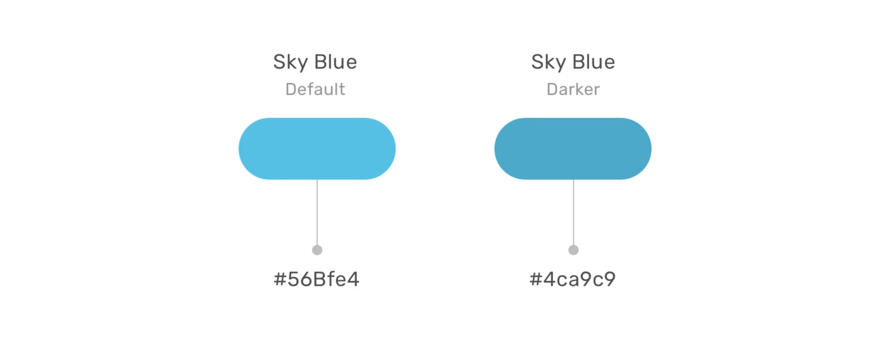

上图展示了一组默认的天蓝色和较深的天蓝色，用十六进制格式表示。从代码上很难看出它们都是蓝色，只是深浅不同。

在实际工作中，我们经常需要快速测试和验证一个稍深或稍浅的颜色，但用十六进制格式很难不打开调色板就直接修改成想要的颜色。

幸运的是，HSL 颜色可以很好地解决这个问题，并为我们带来更多可能性。

## HSL 是什么?

HSL 代表色相（Hue）、饱和度（Saturation）和亮度（Lightness）。它基于 RGB 色轮，每种颜色都由一个角度值、饱和度和亮度的百分比值来表示。


以刚才提到的天蓝色为例。我们可以从调色板中选择天蓝色，得到它的 HSL 值为 `hsl(196, 100%, 64%)`，如下图所示：

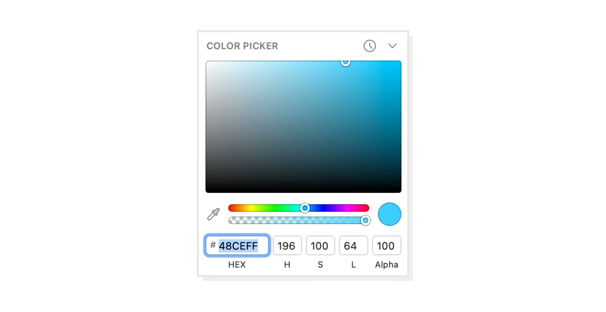

`hsl(196, 100%, 64%)` 中，第一个值 `196`是角度，它代表选择的颜色的角度。在这个例子中，它是天蓝色，一旦我们确定了角度，就可以开始根据需要调整饱和度和亮度。

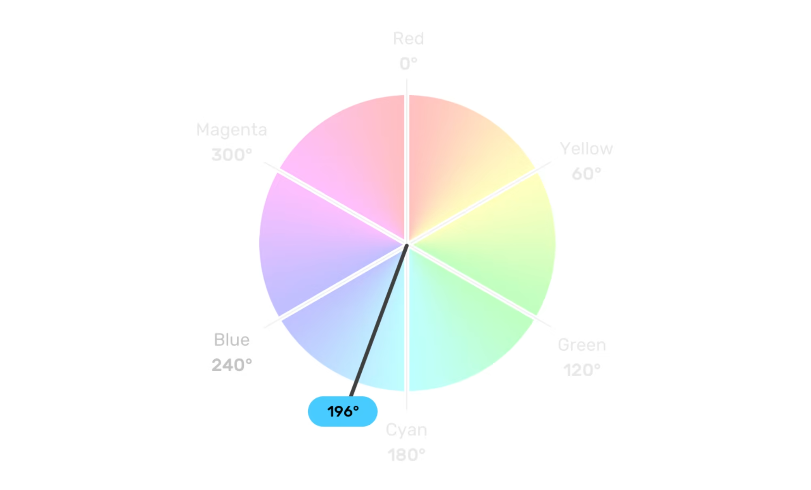

### 饱和度（Saturation）

颜色的饱和度（saturation）是指色彩的纯度或强度，它描述了颜色与灰色之间的差异程度，衡量了颜色中灰色的比例。 0% 饱和度表示完全没有颜色（灰度），100% 饱和度表示最纯粹、最鲜艳的颜色。

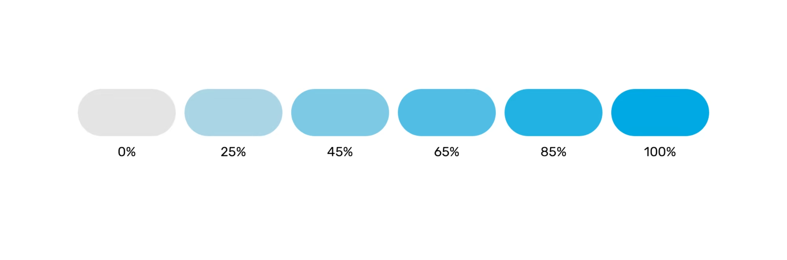

### 亮度（Lightness）

颜色的亮度（Lightness）是指颜色的明暗程度，它描述了颜色的明暗程度，0% 亮度表示黑色，100% 亮度表示白色，50% 亮度通常表示颜色的中间调。

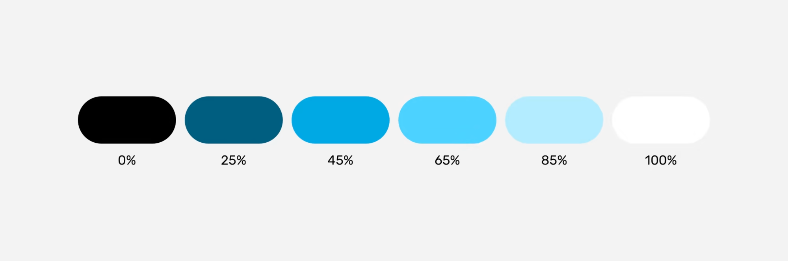

如下图所示：

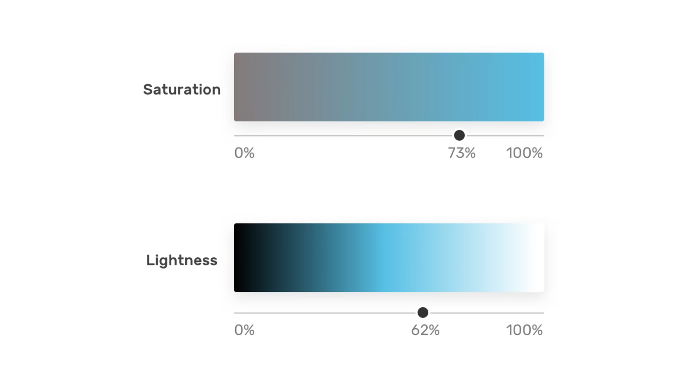

这样，我们就有了三个值，分别代表颜色、角度、饱和度和亮度，从而可以在 CSS 中表示颜色：

``` css
.element {
    background-color: hsl(196, 73%, 62%);
}
```

通过仅修改颜色角度（也就色相 Hue），我们可以获得饱和度和亮度相似的颜色。这在处理新品牌颜色时非常有用，因为它可以创建一组一致的辅助品牌颜色，如下图所示：

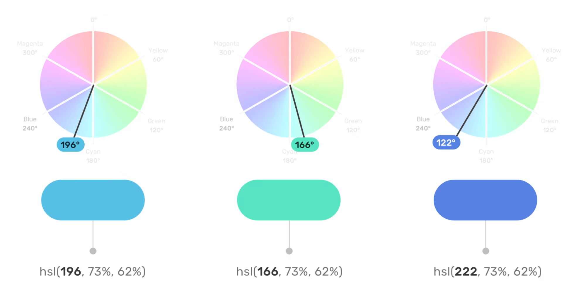

是不是觉得这三种颜色在饱和度、亮度方面有相关性？这仅仅通过改变颜色角度即可实现。这就是用 HSL 表示颜色的好处，与其他颜色类型相比，它更易于阅读和编辑。

## HSL 使用场景

### hover 时修改颜色

当需要在鼠标悬停时让某个组件的颜色变深，用 HSL 可以轻松实现：


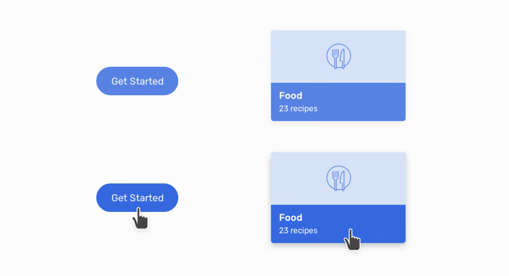

``` css {11-13}
:root {
  --primary-h: 221;
  --primary-s: 72%;
  --primary-l: 62%;
}

.button {
  background-color: hsl(var(--primary-h), var(--primary-s), var(--primary-l));
}

.button:hover {
  --primary-l: 54%;
}
```

这里的关键是将 CSS 变量与 HSL 颜色结合使用。鼠标悬停时，只需改变亮度值即可。亮度值越高，颜色越亮；要得到较暗的色相，我们需要降低亮度。

### 主题色

当设计中使用相同颜色但不同色相时，HSL 就很方便了。考虑以下设计:

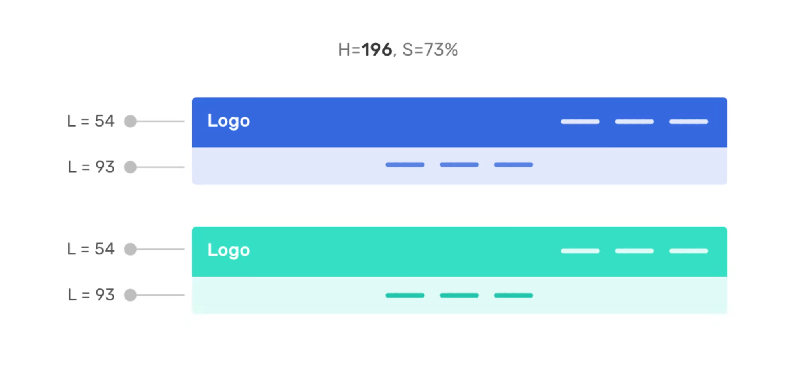

主导航栏使用主题色（primary color），而次级导航则使用较浅的颜色。通过 HSL，我们只需改变亮度值就能轻松获得更浅的颜色。

这在需要支持多个主题的 UI 中特别有用。例如,下面两个主题之间的切换只需修改色相值即可。

第一个主题：

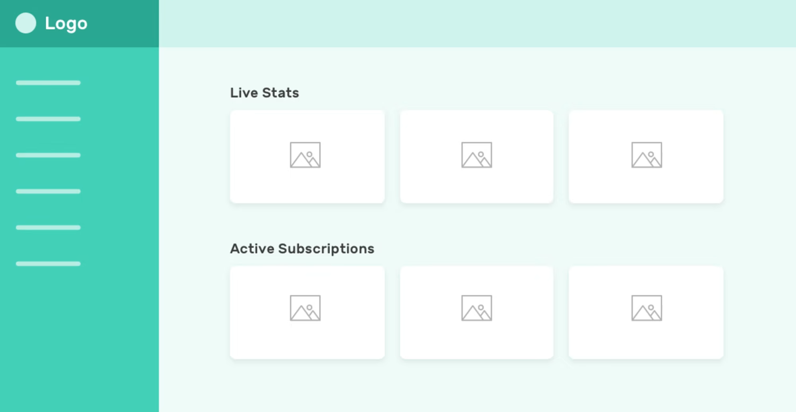

第二个主题：

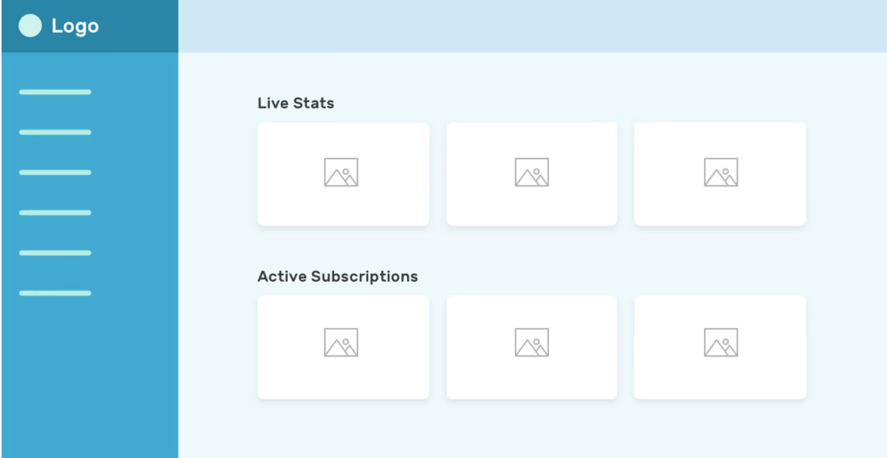

### 调色盘

通过改变亮度（Lightness），我们可以为某种颜色创建一组色相，以便在整个 UI 中使用。

这对于设计系统非常有用，在设计系统中，设计师需要为开发人员提供品牌每种颜色的色相。

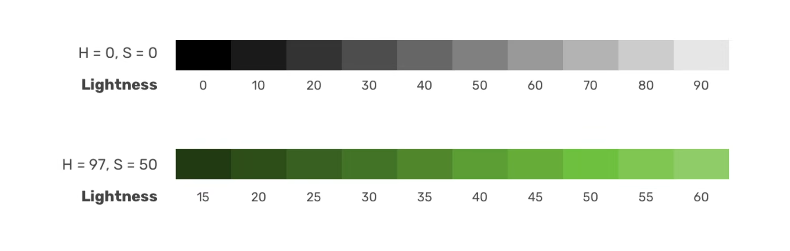

### 按钮的变化

当我们有使用相同颜色，但具有不同色相的主要（primary）和次要（secondary）按钮时，可以使用 HSL 来很轻松地实现：

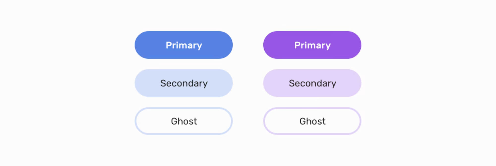

``` css {12,17}
:root {
  --primary-h: 221;
  --primary-s: 72%;
  --primary-l: 62%;
}

.button {
  background-color: hsl(var(--primary-h), var(--primary-s), var(--primary-l));
}

.button--secondary {
  --primary-l: 90%;
  color: #222;
}

.button--ghost {
  --primary-l: 90%;
  background-color: transparent;
  border: 3px solid hsl(var(--primary-h), var(--primary-s), var(--primary-l));
}
```

### 渐变色的实现

通过 HSL，仅需通过调整色相（Hue）即可实现统一的渐变效果：

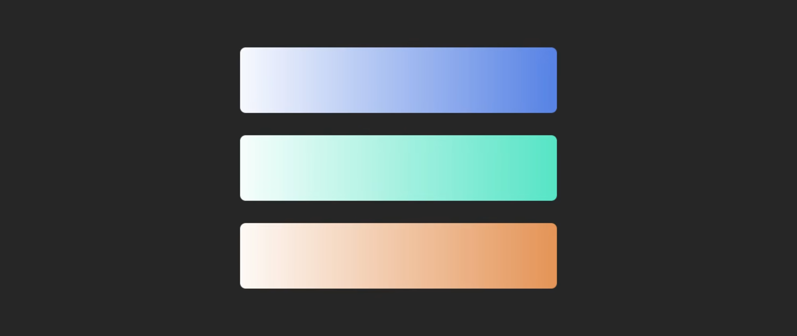

``` css {10-12}
.section {
  background:
    linear-gradient(
      to left,
      hsl(var(--primary-h), var(--primary-s), var(--primary-l)),
      hsl(var(--primary-h), var(--primary-s), 95%)
    );
}

.section-2 {
  --primary-h: 167;
}
```

上面的渐变从右侧开始为纯色，然后逐渐变淡接近白色，通过修改 `--primary-h` 值即可实现不同的颜色渐变效果。

## 翻译总结

原文作者指出十六进制格式表示颜色存在两个问题:

1. 不直观，难以直接识别颜色。
2. 局限性大，难以在不使用调色板的情况下直接修改颜色属性。

然而，在实际开发中，这两个问题并不突出:

1. 许多代码编辑器（如 VS Code）都有插件可以在 CSS 颜色值旁直观显示对应的颜色，无论是十六进制还是 HSL 格式。
2. 在企业级项目中，通常有专门的设计师负责确定颜色，开发者只需使用设计师提供的色值，很少需要自行调整颜色。
3. 使用十六进制格式时，也可以借助 Less 或 Sass 等提供的 `lighten` / `darken` 等函数来实现颜色的加深和变淡效果。

尽管如此，作者提出的 HSL 使用场景确实很实用。如果让我选择:

1. 在个人项目开发中，使用 HSL 颜色确实可以快速修改和验证效果。
2. 在公司项目开发中，最好与团队规范保持一致。如果团队都使用十六进制表示颜色，那就遵循这个惯例。

<Vssue title="在 CSS 中使用 HSL" />