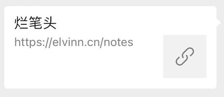

# 问题解决记录

## 测试用例导致内存爆炸

### 问题

在跑抽奖概率相关的测试用例时（重复一百万次测试中奖概率），发现持续二十多分钟后内存爆炸异常退出。

### 原因

每次抽奖都会调用 `console.log/console.warn` 等向 shell 打印日志，但是测试框架 jest 在执行测试用例的过程中不会直接输出日志，而是等测试用例成功后再输出，所以 jest 在持续的收集日志（保存在内存中），最终一百万次测试用例的日志将内存撑爆。

### 解决方式

1. 通过 silent=true 配置，让 jest 直接抛弃 `console.log/console.warn` 等输出。
2. 让 jest 立即输出日志，而不是将其收集起来后输出，不过这个功能仍在开发中，参考 [issue: Jest eats up all console.log messages during debugging](https://github.com/facebook/jest/issues/8208)。

<right-text>2020.11.26</right-text>

## 微信分享链接自定义分享内容

### 问题

在微信中分享自己的笔记时，发现仅能展示标题，无法自动爬取文章内容和缩略图，显示效果比较丑陋。



### 原因

按照网上说的方法，有两种实现的方式：

1. 在有一个通过微信认证的公众号前提下，使用 [JSSDK 分享接口](https://developers.weixin.qq.com/doc/offiaccount/OA_Web_Apps/JS-SDK.html#111) 自定义分享的内容：

``` js
wx.ready(function () {   //需在用户可能点击分享按钮前就先调用
  wx.updateAppMessageShareData({ 
    title: '', // 分享标题
    desc: '', // 分享描述
    link: '', // 分享链接，该链接域名或路径必须与当前页面对应的公众号JS安全域名一致
    imgUrl: '', // 分享图标
    success: function () {
      // 设置成功
    }
  })
}); 
```

2. 分享的标题会自动抓取页面的 `title`，缩略图会自动抓取网页的第一张图片，所以可以通过如下方式注入缩略图：

``` html
<!-- 该方法已失效 -->
<div id='wx_pic' style='margin:0 auto;display:none;'>
  
</div>
```

然而遗憾的是，经验证发现第二种方法已无法使用，根据[微信团队的说法](https://mp.weixin.qq.com/s?__biz=MjM5NDAxMDg4MA==&mid=2650959286&idx=1&sn=0827bb3e1a2cc6fd21d4e01eb82ea1be&chksm=bd788fd98a0f06cfd318c01ec3d800698d47d54964eed389c5e7a1590a711bd6535b71479475&mpshare=1&scene=23&srcid=0331eSY1QUWHhUBxxEsSmnM1#rd)，*对于未接入微信JSSDK或已接入但JSSDK调用失败的网页，被用户分享时，分享卡片将统一使用默认缩略图和标题简介，不允许自定义*。

### 解决方式

若想在微信分享时自定义分享内容，则必须通过 JSSDK 分享接口进行自定义，因而需要有一个通过微信认证的公众号。对于公司而言这不存在障碍，但是对于个人开发者来说，由于微信公众号关闭了个人的微信认证能力，所以目前个人也就暂时没有办法能够自定义分享了。

<right-text>2020.12.24</right-text>

<Vssue title="前端问题解决记录" />