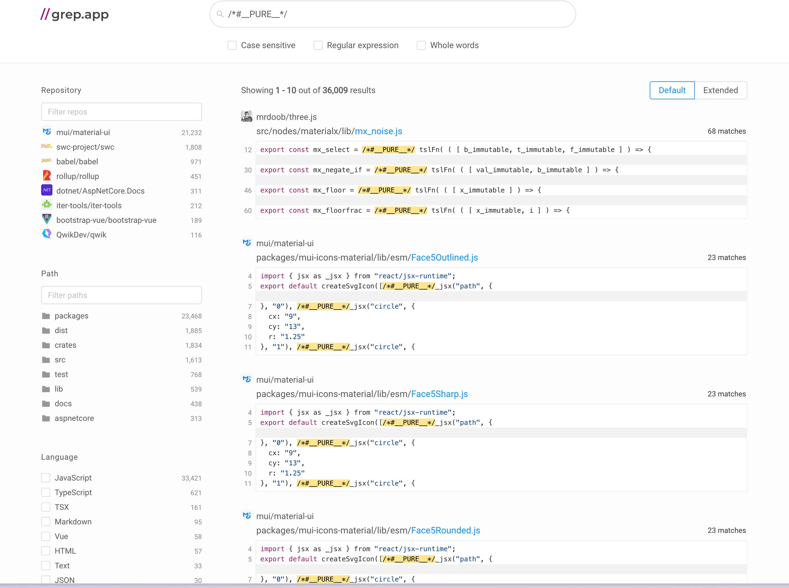

# Tree Shaking

## 引言

*Tree Shaking* 是一种通过静态分析技术来移除 JavaScript 中未使用代码的优化技术。在前端领域，它因为 rollup.js 而普及，形象地描述了移除代码中 Dead Code的过程。

通过 Tree Shaking，我们可以显著减少最终打包文件的体积，从而提高网页的加载速度和性能。

## Tree Shaking 的基本原理

Tree Shaking 是通过**静态分析**来实现的，可以在不执行代码的情况下，通过分析代码的接口和行为，来确定哪些代码是未使用的，整体步骤如下：

1. **解析代码**：解析代码，提取出所有的变量、函数、类等，形成一个抽象语法树（AST）。
2. **构建依赖关系图**：从入口处开始，递归地遍历所有模块，构建一个完整的依赖关系图。
3. **标记未使用的代码**：在构建依赖关系图的过程中，标记所有未使用的代码。
4. **移除未使用的代码**：根据标记结果，移除所有未使用的代码。

::: tip
因为 Tree Shaking 是通过静态分析实现的，所以必须使用 ES6 模块化的方式来组织代码。

它不支持 CJS 模块，因为 CJS 模块是基于 CommonJS 规范的，它具有动态特性，需要在运行时解析依赖关系。
:::

## 一个例子

我们来看一个 Tree Shanking 的例子，可以[点击这里](https://github.stackblitz.com/elvinn/tree-shaking-demo)直接在线体验,具体代码如下：

```js
// index.js
import { add } from "./util";

const sum = add(1, 2)
console.log(sum);

// util.js
export function add(a, b) {
  return a + b;
}

export function sub(a, b) {
  return a - b;
}
```

代码很简单，我们在 `util.js` 中导出了两个函数，分别是 `add` 和 `sub`，然后在 `index.js` 中导入了 `add`，并进行了调用。注意，我们并没有使用 `sub` 函数。

接着，可以通过 rollup.js 进行打包，执行命令 `npx rollup src/index.js -f esm -o bundle.js`，得到如下输出：

``` js
// bundle.js
function add(a, b) {
  return a + b;
}

const sum = add(1, 2);
console.log(sum);
```

可以看到，其中并不包含 `sub` 函数的代码，这说明 Tree Shaking 生效了，因为 `sub` 函数并没有被使用，所以它被移除了。


## 最佳实践

为了实现更好的 Tree Shaking，还有一些技巧需要注意，例如：

1. 使用命名导出（`named export`）代替默认导出（`default export`）。
2. 使用 `/*#__PURE__*/` 、`/*#__NO_SIDE_EFFECTS__` 等注释进行标记。

### 使用命名导出

如果模块使用默认导出，那么需要在运行时才能确定其内容，导致无法进行 Tree Shaking。

可以[点击这里](https://github.stackblitz.com/elvinn/tree-shaking-default-export-demo)直接在线体验,具体代码如下：

```js
// index.js
import { add } from "./util";

const sum = add(1, 2)
console.log(sum);

// util.js
function add(a, b) {
  return a + b;
}

function sub(a, b) {
  return a - b;
}

export default { add, sub };
```

代码很简单，和之前的例子类似，只是将 `util.js` 中的导出修改为了默认导出。

接着，可以通过 rollup.js 进行打包，执行命令 `npx rollup src/index.js -f esm -o bundle.js`，得到如下输出：

``` js
// bundle.js
function add(a, b) {
  return a + b;
}

function sub(a, b) {
  return a - b;
}

var util = { add, sub };

const sum = util.add(1, 2);
console.log(sum);
```

可以看到，哪怕我们没有使用 `sub` 函数，但是它仍然被包含在打包后的文件中。

所以为了更好的 Tree Shaking，我们需要使用命名导出。

### 使用注释标记

有时候，Tree Shaking 担心副作用（Side Effect，例如输入输出、定时器等）的原因，会导致不移除未使用的代码，这种时候我们就需要使用特殊的注释标记，来告诉打包工具更多信息：

1. `/*#__PURE__*/`：用于**执行函数**时，提示编译器这次函数调用是纯粹的，没有副作用。如果这个函数的返回值没有被使用，编译器可以安全地移除这个调用，例如 `const result = /*#__PURE__*/ somePureFunction();`
2. `/*#__NO_SIDE_EFFECTS__`：用于**声明函数**时，提示编译器这个函数是纯粹的，没有副作用，例如 `/*#__NO_SIDE_EFFECTS__*/ function impure() { console.log('side-effect'); }`

通过搜索 Github，我们可以在常见的第三方库中（包括 Vue、React），看到大量这些注释标记的使用：



## 参考文档

1. [rollup.js](https://rollupjs.org/configuration-options/#pure)

<Vssue title="Tree Shaking" />
