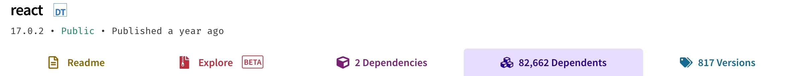
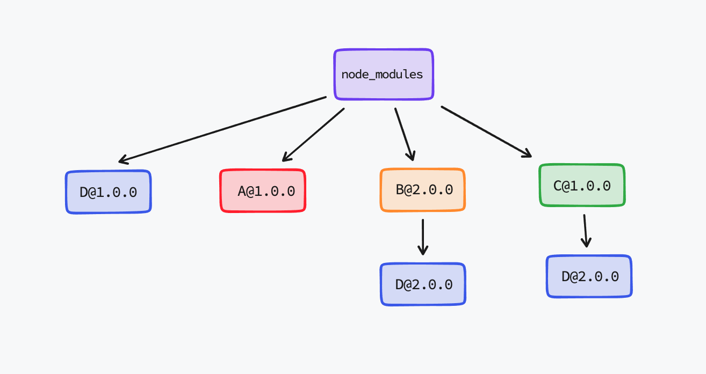

# pnpm

## pnpm 是什么？

pnpm 是 *performant node package manager* 的缩写，它会将本地各个项目中的 `node_modules` 依赖集中式安装在一起，并通过软硬链接的方式共用依赖，避免重复安装，从而节省了大量的硬盘空间，并且安装速度更快。

## pnpm 解决了什么问题？

既然 pnpm 是用于替代 npm 的，那么肯定是 npm 存在着一些问题，而 pnpm 能够解决它们，所以接下来先介绍下 npm 的历史和当前存在的问题。

在 npm v3 以前的版本，node_modules 的目录结构是和依赖的树形结构是直接对应的，也就是说如果 A 依赖于 B，B 依赖于 C，C 依赖于 D，那么 D 最终的安装路径为 `node_modules/A/node_modules/B/node_modules/C/node_modules/D`，这样子做存在两个问题：

  - 底层被依赖的包安装路径过深，而 Windows 对长路径的支持有问题。
  - 如果一个底层的包被多个上层包所依赖，那么这个底层的包会安装在多个上层包的子目录中，导致硬盘空间的浪费。

为了解决这些问题，npm v3 开始引入了“扁平化“的功能，还是用刚才的例子，如果 A 依赖于 B，B 依赖于 C，C 依赖于 D，那么在没有其它依赖的情况下，现在 A / B / C / D 都会直接安装在 `node_modules` 下，从而避免了更深的层级结构。

不过虽然“扁平化”解决了一些问题，但是还遗留了小部分未解决，同时也引入了新的问题，而 pnpm 则针对这些做了处理。

### 空间占用问题

虽然“扁平化”能避免一个项目中底层的包被多个上层包所依赖时重复安装的问题，但是在不同项目之间同一个包被多次安装的情况依然存在。

以常用的 React 为例，它一共有 **81782** 个依赖，如果有多个项目使用 React 的话，那么这些依赖在多个项目中都会被安装一遍，浪费珍贵的硬盘空间（512 GB MacBook Pro 的每一寸空间都很珍贵）。



既然这些依赖是相同的话，一个自然的想法就是将它们集中式存储起来，然后多个项目直接使用即可，而 pnpm 也的确是这样实现的，如下图所示：


### 幽灵依赖问题（Phantom dependencies）

假如在 `package.json` 中声明了对 `packageA` 的依赖，未声明对 `packageB` 的依赖，且 `packageA` 本身是依赖 `packageB` 的，那么在使用 npm 安装的项目中，如下代码也能正常运行（因为扁平化安装后都在 node_modules 目录的第一层级）：

``` js
const packageA = require('packageA');
const packageB = require('packageB'); // ???
```

但这是不符合预期的，因为使用了未在 `package.json` 中声明的依赖，这也是**幽灵依赖**这个名称的来源。需要注意的由于代码对 `packageB` 的依赖未显示声明，所以无法控制它的版本，后续若它进行了 BREAK CHANGE，则可能会导致代码执行出错。

### 多重分身问题（doppelgangers）

假设项目依赖了包 A / B / C，其中 A 依赖包 D@1.0.0 版本，包 B / C 依赖包 D@2.0.0 版本，那么安装后可能的一种情况下如图所示：



（图片来源于 [YUEXUN'S BLOG](https://www.yuexun.me/blog/problems-with-npm-and-how-pnpm-handles-them/)）

那么此时在硬盘上其实存在了两份包 D@2.0.0 的代码，这样会存在一些问题：

- 安装速度变慢：重复的包会导致额外的下载、解压时间。
- 爆炸性的打包体积：重复的包占据额外的空间。
- 单例模式不起作用：由于 D@2.0.0 有两份单独的代码，那么对它的依赖 B / C 拿到的其实是不同的实例。

对于这些问题，pnpm 通过软硬链接的方式进行了巧妙的解决，推荐使用！

<Vssue title="pnpm" />
