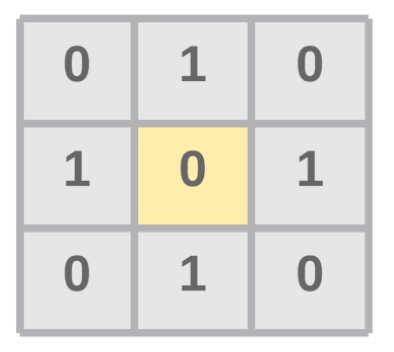
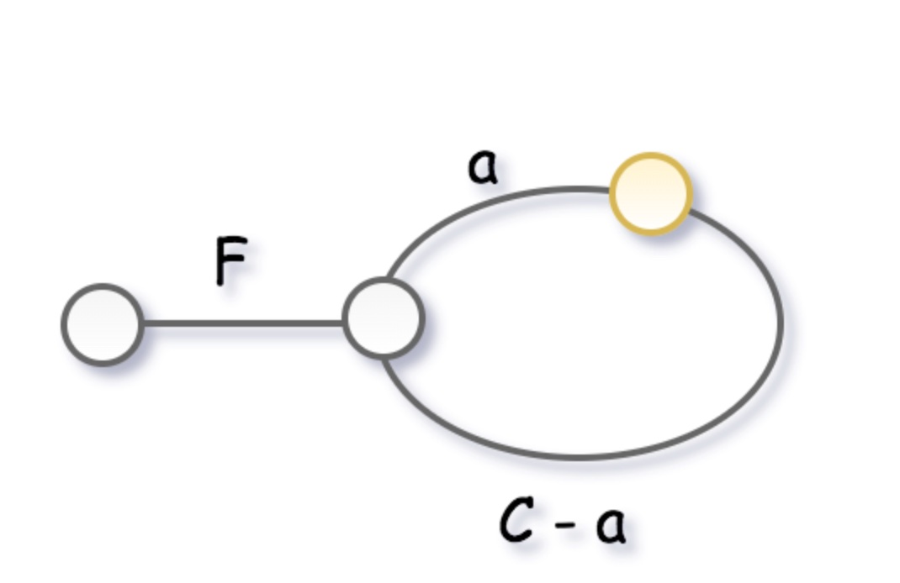

# 常用技巧

## 遍历二维数组中元素周边的八个元素

在面对二维数组的问题时，经常需要访问中心元素（图中黄块）的相邻八个元素（图中灰块）。



我们可以借助一个方向数组来进行遍历，从而避免手写上下左右的位置计算：

``` js {1,8-9}
const directions = [-1, 0, 1] // 方向数组

let centerX = 1
let centerY = 1

for (let i = 0; i < 3; i++) {
  for (let j = 0; j < 3; j++) {
    const pointX = centerX + directions[i]
    const pointY = centerY + directions[j]
    if (pointX === centerX && pointY === centerY) {
      // 跳过中心点
      continue;
    }

    doSomeThing(pointX, pointY)
  }
}
```

## 快慢指针

快慢指针指在数组或者链表中，以不同的速度移动两个指针（一般是两倍的速度）。这种方法也叫 Tortoise and Hare Algorithm（龟兔赛跑算法），非常的形象。

这种方法常用来解决两种类型的问题：

1. 判断是否存在环路（快慢指针相遇则说明存在环路）
2. 判断是否存在环路，并给出环路开始的节点（先让快慢指针相遇，然后再让慢指针回到起点，快指针速度变得和慢指针一样）




通常而言，能利用快慢指针算法解决的问题复杂度都很低，时间复杂度为 O(n)，空间复杂度为 O(1)。

相关题目：

1. [141. Linked List Cycle](https://leetcode.com/problems/linked-list-cycle/)
2. [142. Linked List Cycle II](https://leetcode.com/problems/linked-list-cycle-ii/)
3. [287. Find the Duplicate Number](https://leetcode.com/problems/find-the-duplicate-number/)
