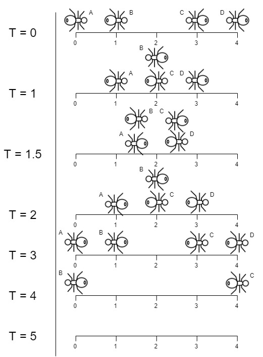

# 好玩的题目

## [所有蚂蚁掉下来前的最后一刻 <Badge text="来源: LeetCode" />](https://leetcode-cn.com/problems/last-moment-before-all-ants-fall-out-of-a-plank/) 

### 题目
有一块木板，长度为 n 个单位 。一些蚂蚁在木板上移动，每只蚂蚁都以 **每秒一个单位** 的速度移动。其中，一部分蚂蚁向 **左** 移动，其他蚂蚁向 **右** 移动。

当两只向 **不同** 方向移动的蚂蚁在某个点相遇时，它们会同时改变移动方向并继续移动。假设更改方向不会花费任何额外时间。

而当蚂蚁在某一时刻 t 到达木板的一端时，它立即从木板上掉下来。

给你一个整数 n 和两个整数数组 left 以及 right 。两个数组分别标识向左或者向右移动的蚂蚁在 t = 0 时的位置。请你返回最后一只蚂蚁从木板上掉下来的时刻。

示例：




输入：n = 4, left = [4,3], right = [0,1]

输出：4

解释：如上图所示：
- 下标 0 处的蚂蚁命名为 A 并向右移动。
- 下标 1 处的蚂蚁命名为 B 并向右移动。
- 下标 3 处的蚂蚁命名为 C 并向左移动。
- 下标 4 处的蚂蚁命名为 D 并向左移动。

请注意，蚂蚁在木板上的最后时刻是 t = 4 秒，之后蚂蚁立即从木板上掉下来。（也就是说在 t = 4.0000000001 时，木板上没有蚂蚁）。

### 思考

初看到这题的时候，感觉无处下手：每一刻都有无数只蚂蚁在左右两个方向上移动，而且不同方向的两只蚂蚁相遇后还会变换方向，整个系统处在一个混沌的状态。

思考了一段时间后，发现这个问题可以从微观-单个蚂蚁、宏观-所有蚂蚁两个角度来看待这个问题：

- **微观角度**：对于单个蚂蚁而言，未和其它蚂蚁相遇时，一直匀速向一个方向前进；和另一个方向的蚂蚁相遇时，两只蚂蚁均调头反向运动，这时其实也可以看作两只蚂蚁 **并未改变方向**， 仍保持了之前的运动状态。所以说，对于单个的蚂蚁，一直是保持着相同的速度，向着固定的方向运动。
- **宏观角度**：可以将每个蚂蚁的运动速度和方向视为整个蚂蚁系统的一个分向量，那么整个系统的运动状态可以由所有蚂蚁的运动分向量相加来表示。有意思的是，两只反向的蚂蚁相遇时，虽然它们会同时改变移动方向并继续移动，但是运动分向量相加的结果并不会改变，也就是说对整个系统的运动状态不会产生影响。

经历了上面两个角度的思考之后，可以发现两只反向蚂蚁相遇时 **同时改变移动方向并继续移动** 这个设定并不会对问题的结果产生影响，因而只需要考虑初始状态时，向左/向右方向的蚂蚁中，运动时间最长的蚂蚁即可。

``` js
const getLastMoment = (n, left, right) => {
  let mostLeft = 0
  let mostRight = n

  // 对于向左运动的蚂蚁，坐标值越大运动时间越长
  left.forEach(i => (mostLeft = Math.max(mostLeft, i)))

  // 对于向右运动的蚂蚁，坐标值越小运动时间越长
  right.forEach(i => (mostRight = Math.min(mostRight, i)))

  return Math.max(mostLeft, n - mostRight)
}
```
