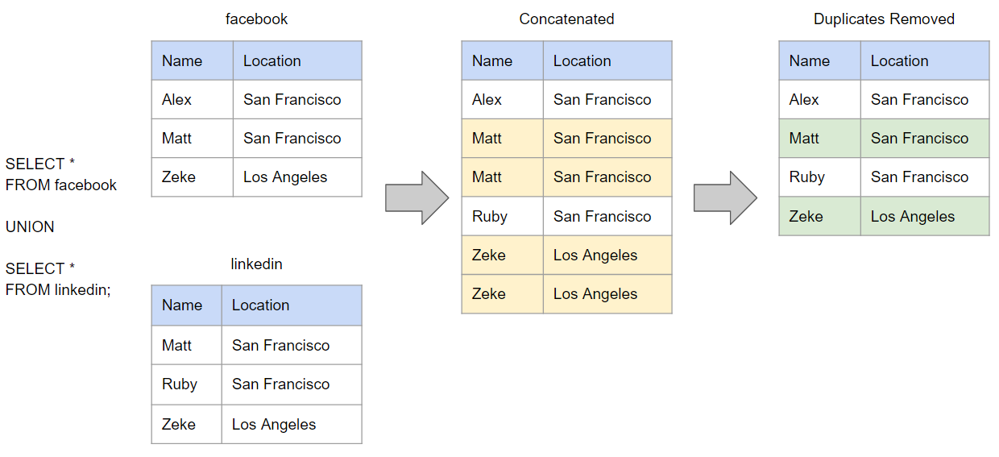
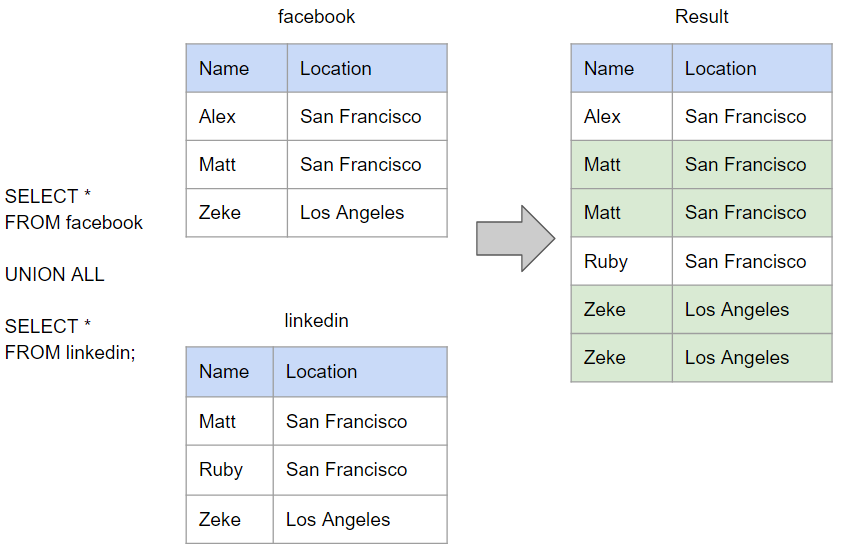

# MySQL

## modify 和 change 的区别

从功能上而言，两者都可以用于修改表的字段，其中 `change` 相较于 `modify` 而言，多了一个给字段重命名的能力。同时也是由于多的这个能力，导致两者在语法格式上稍有不同：

``` sql
ALTER TABLE t1 CHANGE col_a col_a BIGINT NOT NULL; # 使用 change

ALTER TABLE t1 MODIFY col_a BIGINT NOT NULL; # 使用 modify
```

也就是说在使用 `change` 的时候，哪怕不涉及重命名，仍需要将字段名写两次。

## union 和 union all 的区别

`union` 和 `union all` 都可以将两个或多个有相同数量的结果集进行合并，不过也有一点区别：

- `union`: 会进行去重;
- `union all`: 会保留重复的数据。

### union


### union all


<Vssue title="MySQL" />