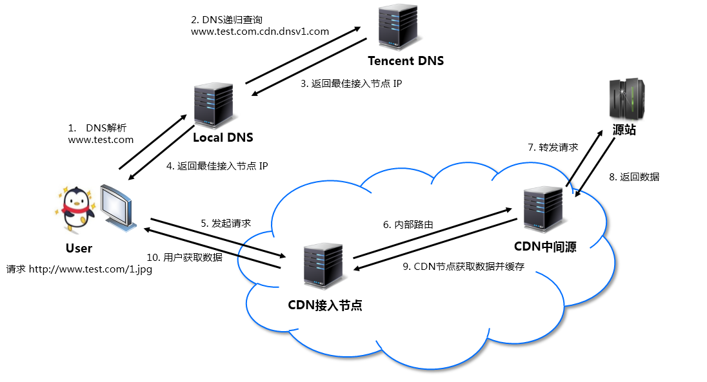

# CDN

**CDN** 的全称是 Content Delivery Network，翻译过来就是内容分发网络。它在网络的边缘节点上提供了大量的缓存服务器，能够让用户在距离自己最近的边缘节点上就获取到请求的内容，而不用请求到更远（意味着耗时更长）的业务服务器，从而提高内容获取的速度，提升用户体验。

目前云服务器厂商都提供了 CDN 加速服务，例如：

  - [腾讯云 - CDN](https://cloud.tencent.com/product/cdn)
  - [阿里云 - CDN](https://www.aliyun.com/product/cdn)

## 如何解析到离用户最近的边缘节点？

假如用户在请求 `www.test.com/index.html` 这个资源，那么它首先需要将 `www.test.com` 这个域名解析成服务器的 IP 地址，然后向这个 IP 地址发起请求，获取 `/index.html` 资源。

CDN 服务在这一步起到了关键作用，它会**将请求的服务器域名解析成距离用户最近的 IP 地址**，具体是怎么做的呢？

关键在于三点：
  - 利用 `CNAME` 的能力，把对 `www.test.com` 域名的解析变成对特定 CDN 域名的解析，例如下图中的 `www.test.com.cdn.dnsv1.com`
  - CDN 服务商维护着一个巨大而精确的 IP 地址数据库，能根据用户客户端的 IP 判断出客户端所在的地区、网络运营商等信息。
  - 当解析 `www.test.com.cdn.dnsv1.com` 域名 IP 时，会向 CDN 服务的 DNS 域名发起请求（也就是下图中的第 2 步），此时 CDN 服务的 DNS 域名可以根据用户客户端的 IP 返回一个距离它最近的缓存服务器 IP

腾讯云文档里有一个图画的非常清晰：



可以拿我自己的域名做个实验，`elivnn.cn` 开启了腾讯云 CDN 加速的功能，执行 `dig elvinn.cn` 命令进行 DNS 解析时可以获取如下的结果：

```{13-15}
; <<>> DiG 9.10.6 <<>> elvinn.cn
;; global options: +cmd
;; Got answer:
;; ->>HEADER<<- opcode: QUERY, status: NOERROR, id: 3183
;; flags: qr rd ra; QUERY: 1, ANSWER: 3, AUTHORITY: 3, ADDITIONAL: 15

;; OPT PSEUDOSECTION:
; EDNS: version: 0, flags:; udp: 4096
;; QUESTION SECTION:
;elvinn.cn.			IN	A

;; ANSWER SECTION:
elvinn.cn.		600	IN	CNAME	elvinn.cn.cdn.dnsv1.com.
elvinn.cn.cdn.dnsv1.com. 600	IN	CNAME	tcb-0006158d.tcb.cdntip.com.
tcb-0006158d.tcb.cdntip.com. 600 IN	A	14.215.166.141
```

从第 13-15 行的结果，可以清晰的看到域名的解析经历了这样一个过程：`elvinn.cn -> elvinn.cn.cdn.dnsv1.com -> tcb-0006158d.tcb.cdntip.com -> 14.215.166.141`，最后得到的 `14.215.166.141` 就是距离我最近的缓存服务器 IP 地址。

利用工具（例如 [ip.cn](ip.cn)）可以查询到 `14.215.166.141` 位于广东省广州市的电信机房，的确是离我很近。


<Vssue title="CDN" />