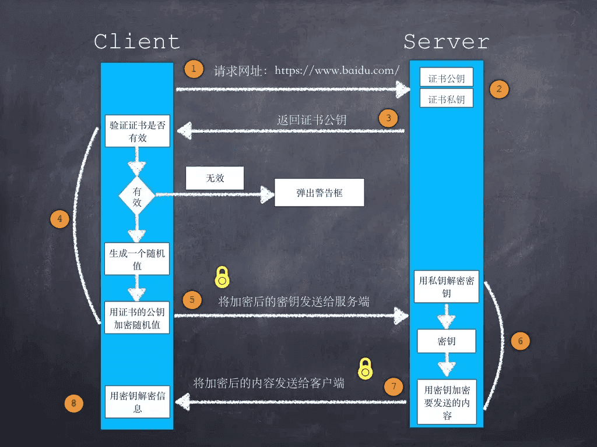

# HTTPS

在引入 HTTPS 之前，我们首先来看看已有的 HTTP 存在什么问题呢？因为 HTTP 通过**明文传输数据**，所以存在下列问题：

1. **数据被监听**，网络链路上的节点都可以获取到传输的内容。
2. **数据被篡改**，在传输过程中被第三方拦截并篡改内容（中间人攻击）。
3. **数据被冒充**，用户端无法确认服务器是真正的目标服务器。

为了解决这些问题，提出了 HTTPS 协议，它的的全称是 Hypertext Transfer Protocol Secure （安全的超文本传输协议），在传统的 HTTP 应用层和 TCP 传输层之间加入了 SSL （Secure Socket Layer，安全套接字层）/TSL（Transport Layer Security，传输层安全协议），从而实现了数据的加密与校验。

对于 HTTPS 请求，它的流程如下图所示，：



整个过程中有一些有意思的地方，接下来分开讲一讲。

## 非对称加密与对称加密

首先介绍一下**非对称加密**与**对称加密**：

- **对称加密**：加密方和解密方使用同一个密钥（key），假如这个密钥丢丢失的话就容易造成信息泄漏，它的优点是加解密速度非常快。
- **非对称加密**：有公钥（public key）和私钥（private key）两个密钥，其中公钥用于加密，私钥用于解密，因而公钥可以让所有人知道都没有关系，只要私钥不泄漏就不会导致密文被破解，它的缺点是加解密速度比较慢。

HTTPS 使用的是 **混合加密**，即在不同的阶段使用不同的加密方式：

- 浏览器端随机生成的加密密钥是通过**非对称加密**的方式发送给服务器端，也就是上图中的步骤 5。
- 浏览器和服务端内容数据的加解密通过**对称加密**的方式，例如上图中的步骤 7/8。

那么为什么要用混合加密呢？仅使用一种加密方式的话会碰到哪些问题呢？这里主要是出于两方面的考虑：

- **如果仅使用对称加密的话**：需要把密钥在客户端和服务端之间通过网络传递，但是刚开始 HTTPS 通道建立的时候，整个通道还不可信，因而存在密钥泄漏的风险。 
- **如果仅使用非对称性加密的话**：首先需要客户端也有自己用于加解密的公钥与私钥， 其次非对称加密的加解密速度较慢，对于传输大量内容时，会产生严重的性能问题。

## 证书信任链

在 HTTPS 中，非常关键的一环就是客户端如何验证服务器端证书的有效性，也就是上图中的步骤 3/4。

首先我们来看证书是什么样子的，这里以 [https://elvinn.cn](https://elvinn.cn) 为例，点击地址栏旁边的小锁图标，可以看到如下的信息：


可以看到证书里包含了有效期、申请地区、签发机构等，更关键的是证书里包含了对包含公钥在内整体信息的**摘要签名值**，从而让浏览器在接受到证书时，根据摘要签名值校验证书是否为真。


假如网站证书的内容被修改的话，客户端会利用上一级证书的公钥对网站证书的摘要签名进行验证，若不符合的话则认为证书被篡改。

这里就会出现一个问题，怎么验证上一级证书的有效性呢？实际上，上一级证书通过相同的方式又利用它的上一级证书（也就是上上级证书）的公钥进行摘要签名的验证，从而一直校验到最上级的证书，也就是根证书（root certificate），而根证书是所有信任的起点，被内置在操作系统当中，从而形成了“信任链”。

有一些有意思的问题也值得思考：

1. **为什么需要中间证书呢？** 因为证书的签发机构会由于各种各样的原因导致被取消信任（例如沃通 WoSign 证书被拒绝承认），当中间证书被取消信任时，由它签发的下级证书也都会失效，所以通过中间证书的形式，可以将这种影响控制在一个较小的范围内。
2. **假如网站证书被部署在了第三方的虚假服务器上会有影响吗？** 网站证书没被篡改的情况下，客户端会用正确的公钥进行加密，只要虚假服务器上没获得相应的私钥，那么也无法解密客户端的数据。

## 中间人

既然 HTTPS 是一种端对端的加密通讯协议，那么作为网络中的节点真的就没有办法获取到数据的内容了吗？在实际中，可以通过中间人（man-in-the-middle）实现数据的劫持，也就是说中间人分别与两端创建连接，交换其收到的数据。

大家可以回忆一下自己平时本地开发的时候，仍然可以通过 [Fiddler](https://www.telerik.com/fiddler)、[Charles](https://www.charlesproxy.com/) 和 [whistle](https://github.com/avwo/whistle/) 等代理抓包工具解密 HTTPS 请求中的数据，这又是为什么呢？

其实这也是中间人的一种应用，整个通讯过程可以简单的用下图来表示：

```
Server <---> man in the middle <---> Browser
         ^                       ^
      HTTPS(1)                HTTPS(2)
```

HTTPS(1) 这部分连接冒充浏览器比较容易，因为 HTTPS 服务器一般不认证客户端身份，而 HTTPS(2) 这部分想冒充服务器则比较困难，因为此时需要对应域名的证书私钥，这时候有三种办法：

1. 拿到真实的域名证书私钥。
3. 自己签发一张证书导入到操作系统当中。
2. 从 CA 处签发一张同样域名的证书，从而得到新的一份可用的公私钥。

上面的方法 1 和 2 在平时的开发中都可能用到，例如刚才提到的 [Fiddler](https://www.telerik.com/fiddler)、[Charles](https://www.charlesproxy.com/) 和 [whistle](https://github.com/avwo/whistle/) 等都是向操作系统中导入了自己签发的根证书从而可以揭秘 HTTPS 数据。

<Vssue title="HTTPS" />

