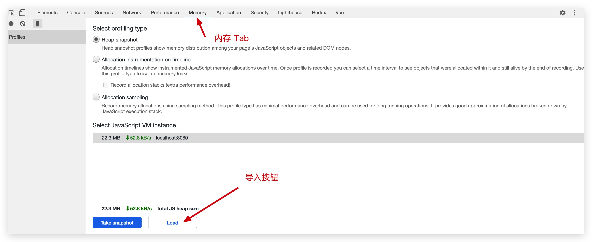
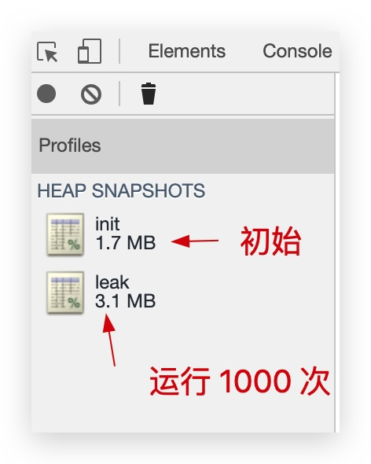
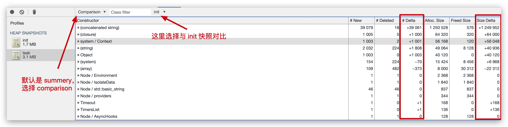
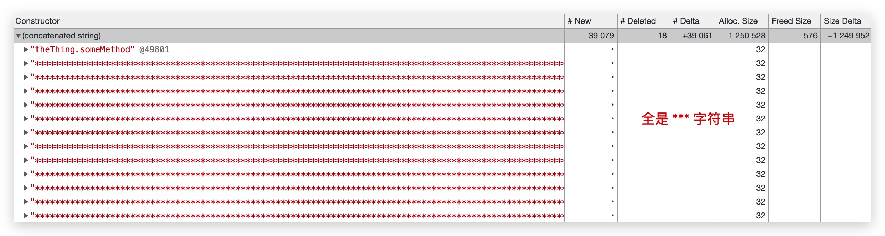
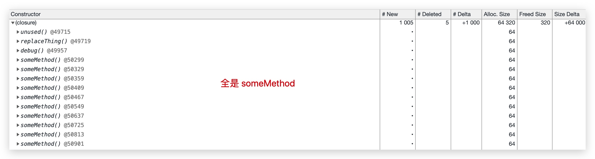
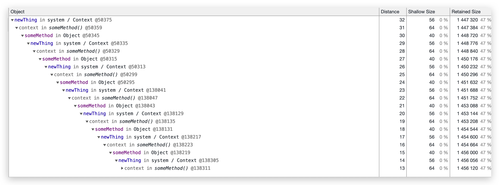

# 内存

Node.js 使用的是 V8 引擎，会自动进行垃圾回收（Garbage Collection，GC），因而写代码的时候不需要像 C/C++ 一样手动分配、释放内存空间，方便不少，不过仍然需要注意内存的使用，避免造成内存泄漏（Memory Leak）。

文章的前半部分会先介绍一些理论知识，然后再举一个定位内存泄漏的例子，感兴趣的朋友可以直接先看看 [这个例子](#内存泄漏定位实操)。

## 整体结构


从上图中，可以看到 Node.js 的常驻内存（Resident Set）分为堆和栈两个部分，具体为：

- 堆
  - 新生代（New Space/Young Generation）：用来临时存储新对象，空间被等分为两份，整体较小，采用 `Scavenge（Minor GC）` 算法进行垃圾回收。
  - 老生代（Old Space/Old Generation）：用来存储存活时间超过两个 Minor GC 时间的对象，采用 `标记清除 & 整理（Mark-Sweep & Mark-Compact，Major GC）` 算法进行垃圾回收，内部可再划分为两个空间：
    - 指针空间（Old pointer space）：存储的对象含有指向其它对象的指针。
    - 数据空间（Old data space）：存储的对象仅含有数据（不含指向其它对象的指针），例如从新生代移动过来的字符串等。
  - 代码空间（Code Space）：用于存放代码段，是唯一的可执行内存（不过过大的代码段也有可能存放在大对象空间）。
  - 大对象空间（Large Object Space）：用于存放超过其它空间对象限制（`Page::kMaxRegularHeapObjectSize`）的大对象（可以参考这个 [V8 Commit](https://chromium.googlesource.com/v8/v8.git/+/5.1.281.35/src/heap/spaces.h#2966)），存放在此的对象不会在垃圾回收的时候被移动。
  - ...
- 栈：用于存放原始的数据类型，函数调用时的入栈出栈也记录于此。

栈的空间由操作系统负责管理，开发者无需过于关心；堆的空间由 V8 引擎进行管理，可能由于代码问题出现内存泄漏，或者长时间运行后，垃圾回收导致程序运行速度变慢。

我们可以通过下面代码简单的观察 Node.js 内存使用情况：

``` js
const format = function (bytes) {
  return `${(bytes / 1024 / 1024).toFixed(2)} MB`;
};

const memoryUsage = process.memoryUsage();

console.log(JSON.stringify({
    rss: format(memoryUsage.rss), // 常驻内存
    heapTotal: format(memoryUsage.heapTotal), // 总的堆空间
    heapUsed: format(memoryUsage.heapUsed), // 已使用的堆空间
    external: format(memoryUsage.external), // C++ 对象相关的空间
}, null, 2));
```

`external` 是 C++ 对象相关的空间，例如通过 `new ArrayBuffer(100000);` 申请一块 Buffer 内存的时候，可以明显看到 `external` 空间的增加。

::: tip
可以通过下列参数调整相关空间的默认大小，单位为 MB：

- `--stack_size` 调整栈空间
- `--min_semi_space_size` 调整新生代半空间的初始值
- `--max_semi_space_size` 调整新生代半空间的最大值
- `--max-new-space-size` 调整新生代空间的最大值
- `--initial_old_space_size` 调整老生代空间的初始值
- `--max-old-space-size` 调整老生代空间的最大值

其中比较常用的是 `--max_new_space_size` 和 `--max-old-space-size`。
:::

新生代的 Scavenge 回收算法、老生代的 Mark-Sweep & Mark-Compact 算法相关的文章已经很多，这里就不赘述了，例如这篇文章讲的不错 [Node.js内存管理和V8垃圾回收机制](https://juejin.im/post/6844903878928891911)。

## 内存泄漏

由于不当的代码，有时候难免会发生内存泄漏，常见的有四个场景：

1. 全局变量
2. 闭包引用
3. 事件绑定
4. 缓存爆炸

接下来分别举个例子讲一讲。

### 全局变量

没有使用 `var/let/const` 声明的变量会直接绑定在 Global 对象上（Node.js 中）或者 Windows 对象上（浏览器中），哪怕不再使用，仍不会被自动回收：

``` js
function test() {
  x = new Array(100000);
}

test();
console.log(x);
```

这段代码的输出为 `[ <100000 empty items> ]`，可以看到 `test` 函数运行完后，数组 `x` 仍未被释放。

### 闭包引用

闭包引发的内存泄漏往往非常隐蔽，例如下面这段代码你能看出来是哪儿里有问题吗？

``` js
let theThing = null;
let replaceThing = function() {
  const newThing = theThing;
  const unused = function() {
    if (newThing) console.log("hi");
  };
  // 不断修改引用
  theThing = {
    longStr: new Array(1e8).join("*"),
    someMethod: function() {
      console.log("a");
    },
  };

  // 每次输出的值会越来越大
  console.log(process.memoryUsage().heapUsed);
};

setInterval(replaceThing, 100);
```

运行这段代码可以看到输出的已使用堆内存越来越大，而其中的关键就是因为 `因为在目前的 V8 实现当中，闭包对象是当前作用域中的所有内部函数作用域共享的`，也就是说 `theThing.someMethod` 和 `unUsed` 共享同一个闭包的 context，导致  `theThing.someMethod` 隐式的持有了对之前的 `newThing` 的引用，所以会形成 `theThing` -> `someMethod` -> `newThing` -> 上一次 `theThing` ->... 的循环引用，从而导致每一次执行 `replaceThing` 这个函数的时候，都会执行一次 `longStr: new Array(1e8).join("*")`，而且其不会被自动回收，导致占用的内存越来越大，最终内存泄漏。

对于上面这个问题有一个很巧妙的解决方法：通过引入新的块级作用域，将 `newThing` 的声明、使用与外部隔离开，从而打破共享，阻止循环引用。

``` js {3,8}
let theThing = null;
let replaceThing = function() {
  {
    const newThing = theThing;
    const unused = function() {
      if (newThing) console.log("hi");
    };
  }
  // 不断修改引用
  theThing = {
    longStr: new Array(1e8).join("*"),
    someMethod: function() {
      console.log("a");
    },
  };

  console.log(process.memoryUsage().heapUsed);
};

setInterval(replaceThing, 100);
```

这里通过 `{ ... }` 形成了单独的块级作用域，而且在外部没有引用，从而 `newThing` 在 GC 的时候会被自动回收，例如在我的电脑运行这段代码输出如下：

``` {7}
2097128
2450104
2454240
...
2661080
2665200
2086736 // 此时进行垃圾回收释放了内存
2093240
```

### 事件绑定

事件绑定导致的内存泄漏在浏览器中非常常见，一般是由于事件响应函数未及时移除，导致重复绑定或者 DOM 元素已移除后未处理事件响应函数造成的，例如下面这段 React 代码：

``` jsx{2-6}
class Test extends React.Component {
  componentDidMount() {
    window.addEventListener('resize', function() {
      // 相关操作
    });
  }
  
  render() {
    return <div>test component</div>;
  }
}
```

`<Test />` 组件在挂载的时候监听了 `resize` 事件，但是在组件移除的时候没有处理相应函数，假如 `<Test />` 的挂载和移除非常频繁，那么就会在 window 上绑定很多无用的事件监听函数，最终导致内存泄漏。可以通过如下的方式避免这个问题：

``` jsx{8-10}
class Test extends React.Component {
  componentDidMount() {
    window.addEventListener('resize', this.handleResize);
  }

  handleResize() { ... }

  componentWillUnmount() {
    window.removeEventListener('resize', this.handleResize);
  }
  
  render() {
    return <div>test component</div>;
  }
}
```


### 缓存爆炸

通过 Object/Map 的内存缓存可以极大地提升程序性能，但是很有可能未控制好缓存的大小和过期时间，导致失效的数据仍缓存在内存中，导致内存泄漏：

``` js
const cache = {};

function setCache() {
  cache[Date.now()] = new Array(1000);
}

setInterval(setCache, 100);
```

上面这段代码中，会不断的设置缓存，但是没有释放缓存的代码，导致内存最终被撑爆。

如果的确需要进行内存缓存的话，强烈建议使用 [lru-cache](https://www.npmjs.com/package/lru-cache) 这个 npm 包，可以设置缓存有效期和最大的缓存空间，通过 LRU 淘汰算法来避免缓存爆炸。

## 内存泄漏定位实操

当出现内存泄漏的时候，定位起来往往十分麻烦，主要有两个原因：

1. 程序开始运行的时候，问题不会立即暴露，需要持续的运行一段时间，甚至一两天，才会复现问题。
2. 出错的提示信息非常模糊，往往只能看到 `heap out of memory` 错误信息。

在这种情况下，可以借助两个工具来定问题： Chrome DevTools 和 [heapdump](https://www.npmjs.com/package/heapdump)。`heapdump` 的作用就如同它的名字所说 - 将内存中堆的状态信息生成快照（snapshot）导出，然后我们将其导入到 Chrome DevTools 中看到具体的详情，例如堆中有哪些对象、占据多少空间等等。

接下来通过上文中闭包引用里内存泄漏的例子，来实际操作一把。首先 `npm install heapdump` 安装后，修改代码为下面的样子：

``` js{3,22}
// 一段存在内存泄漏问题的示例代码
const heapdump = require('heapdump');

heapdump.writeSnapshot('init.heapsnapshot'); // 记录初始内存的堆快照

let i = 0; // 记录调用次数
let theThing = null;
let replaceThing = function() {
  const newThing = theThing;
  let unused = function() {
    if (newThing) console.log("hi");
  };

  // 不断修改引用
  theThing = {
    longStr: new Array(1e8).join("*"),
    someMethod: function() {
      console.log("a");
    },
  };

  if (++i >= 1000) {
    heapdump.writeSnapshot('leak.heapsnapshot'); // 记录运行一段时间后内存的堆快照
    process.exit(0);
  }
};

setInterval(replaceThing, 100);
```

在第 3 行和第 22 行，分别导出了初始状态的快照和循环了 1000 次后的快照，保存为 `init.heapsnapshot` 与 `leak.heapsnapshot`。

然后打开 Chrome 浏览器，按下 F12 调出 DevTools 面板，点击 `Memory` 的 Tab，最后通过 `Load` 按钮将刚刚的两个快照依次导入：



导入后，在左侧可以看到堆内存有明显的上涨，从 1.7 MB 上涨到了 3.1 MB，几乎翻了一倍：



接下来就是最关键的步骤了，点击 `leak` 快照，然后将其与 `init` 快照进行对比：



右侧红框圈出来了两列：

- `Delta`：表示变化的数量
- `Size Delta`：表述变化的空间大小

可以看到增长最大的前两项是 `拼接的字符串（concatenated string ）` 和 `闭包（closure）`，那么我们点开来看看具体有哪些：




从这两个图中，可以很直观的看出来主要是 `theThing.someMethod` 这个函数的闭包上下文和 `theThing.longStr` 这个很长的拼接字符串造成的内存泄漏，到这里问题就基本定位清除了，我们还可以点击下方的 `Object` 模块来更清楚的看一下调用链的关系：


 
图中很明显的看出来，内存泄漏原因就是因为 `newTHing` -> 闭包上下文 -> `someMethod` -> 上一次 `newThing` 这样的链式不断调用导致内存的快速增长。

## 参考文章

1. [Visualizing memory management in V8 Engine ](https://deepu.tech/memory-management-in-v8/)
2. [Github - 内存泄漏的例子](https://github.com/ElemeFE/node-interview/issues/7)
3. [ali node - 正确打开 Chrome devtools](https://github.com/aliyun-node/Node.js-Troubleshooting-Guide/blob/master/0x03_%E5%B7%A5%E5%85%B7%E7%AF%87_%E6%AD%A3%E7%A1%AE%E6%89%93%E5%BC%80%20Chrome%20devtools.md)

<Vssue title="Node.js 内存" />
