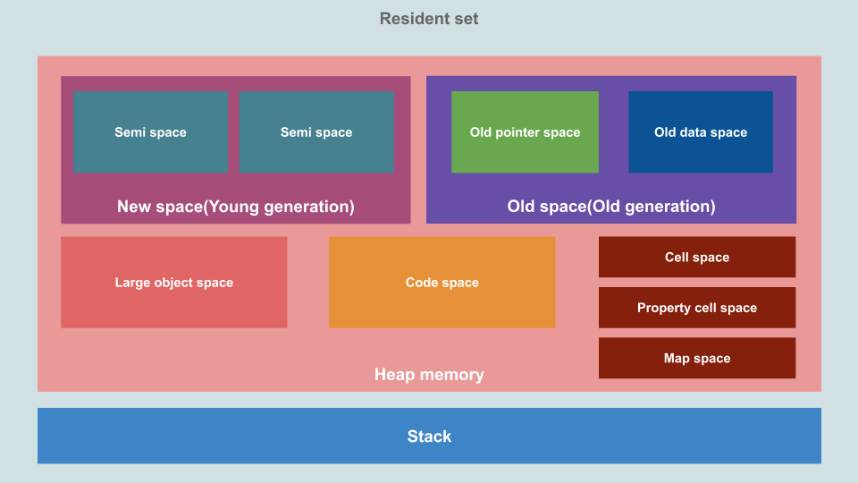

# 内存

Node.js 使用的是 V8 引擎，会自动进行垃圾回收（Garbage Collection，GC），因而写代码的时候不需要像 C/C++ 一样手动分配、释放内存空间，方便不少，不过仍然需要注意内存的使用，避免造成内存泄漏（Memory Leak）。

## 整体结构



从上图中，可以看到 Node.js 的常驻内存（Resident Set）分为堆和栈两个部分，具体为：

- 堆
  - 新生代（New Space/Young Generation）：用来临时存储新对象，空间被等分为两份，整体较小，采用 `Scavenge（Minor GC）` 算法进行垃圾回收。
  - 老生代（Old Space/Old Generation）：用来存储存活时间超过两个 Minor GC 时间的对象，采用 `标记清除 & 整理（Mark-Sweep & Mark-Compact，Major GC）` 算法进行垃圾回收，内部可再划分为两个空间：
    - 指针空间（Old pointer space）：存储的对象含有指向其它对象的指针。
    - 数据空间（Old data space）：存储的对象仅含有数据（不含指向其它对象的指针），例如从新生代移动过来的字符串等。
  - 代码空间（Code Space）：用于存放代码段，是唯一的可执行内存（不过过大的代码段也有可能存放在大对象空间）。
  - 大对象空间（Large Object Space）：用于存放超过其它空间对象限制（`Page::kMaxRegularHeapObjectSize`）的大对象（可以参考这个 [V8 Commit](https://chromium.googlesource.com/v8/v8.git/+/5.1.281.35/src/heap/spaces.h#2966)，存放在此的对象不会在垃圾回收的时候被移动。
  - ...
- 栈：用于存放原始的数据类型，函数调用时的入栈出栈也记录于此。

栈的空间由操作系统负责管理，开发者无需过于关心；堆的空间由 V8 引擎进行管理，可能由于代码问题出现内存泄漏，或者长时间运行后，垃圾回收导致程序运行速度变慢。

我们可以通过下面代码简单的观察 Node.js 内存使用情况：

``` js
const format = function (bytes) {
  return `${(bytes / 1024 / 1024).toFixed(2)} MB`;
};

const memoryUsage = process.memoryUsage();

console.log(JSON.stringify({
    rss: format(memoryUsage.rss), // 常驻内存
    heapTotal: format(memoryUsage.heapTotal), // 总的堆空间
    heapUsed: format(memoryUsage.heapUsed), // 已使用的堆空间
    external: format(memoryUsage.external), // C++ 对象相关的空间
}, null, 2));
```

`external` 是 C++ 对象相关的空间，例如通过 `new ArrayBuffer(100000);` 申请一块 Buffer 内存的时候，可以明显看到 `external` 空间的增加。

::: tip
可以通过下列参数调整相关空间的默认大小，单位为 MB：

- `--stack_size` 调整栈空间
- `--min_semi_space_size` 调整新生代半空间的初始值
- `--max_semi_space_size` 调整新生代半空间的最大值
- `--max-new-space-size` 调整新生代空间的最大值
- `--initial_old_space_size` 调整老生代空间的初始值
- `--max-old-space-size` 调整老生代空间的最大值

其中比较常用的是 `--max_semi_space_size` 和 `--max-old-space-size`。
:::

新生代的 Scavenge 回收算法、老生代的 Mark-Sweep & Mark-Compact 算法相关的文章已经很多，这里就不赘述了，例如这篇文章讲的不错 [Node.js内存管理和V8垃圾回收机制](https://juejin.im/post/6844903878928891911)。

## 内存泄漏

由于不当的代码，有时候难免会发生内存泄漏，常见的有四个场景：

1. 全局变量
2. 闭包引用
3. 事件监听函数
4. 缓存爆炸

接下来分别举个例子讲一讲。

### 全局变量

没有使用 `var/let/const` 声明的变量会直接绑定在 Global 对象上（Node.js 中）或者 Windows 对象上（浏览器中），哪怕不再使用，仍不会被自动回收：

``` js
function test() {
  x = new Array(100000);
}

test();
console.log(x);
```

这段代码的输出为 `[ <100000 empty items> ]`，可以看到 `test` 函数运行完后，数组 `x` 仍未被释放。

### 闭包引用

闭包引发的内存泄漏往往非常隐蔽，例如下面这段代码你能看出来是哪儿里有问题吗？

``` js
let theThing = null;
let replaceThing = function() {
  const newThing = theThing;
  const unused = function() {
    if (newThing) console.log("hi");
  };
  // 不断修改引用
  theThing = {
    longStr: new Array(1e8).join("*"),
    someMethod: function() {
      console.log("a");
    },
  };

  // 每次输出的值会越来越大
  console.log(process.memoryUsage().heapUsed);
};

setInterval(replaceThing, 100);
```

运行这段代码可以看到输出的已使用堆内存越来越大，而其中的关键就是因为

### 事件监听函数

### 缓存爆炸


## 参考文章

1. [Visualizing memory management in V8 Engine ](https://deepu.tech/memory-management-in-v8/)
2. [Github - 内存泄漏的例子](https://github.com/ElemeFE/node-interview/issues/7)
3. [ali node - 正确打开 Chrome devtools](https://github.com/aliyun-node/Node.js-Troubleshooting-Guide/blob/master/0x03_%E5%B7%A5%E5%85%B7%E7%AF%87_%E6%AD%A3%E7%A1%AE%E6%89%93%E5%BC%80%20Chrome%20devtools.md)

<Vssue title="Node.js 内存" />
