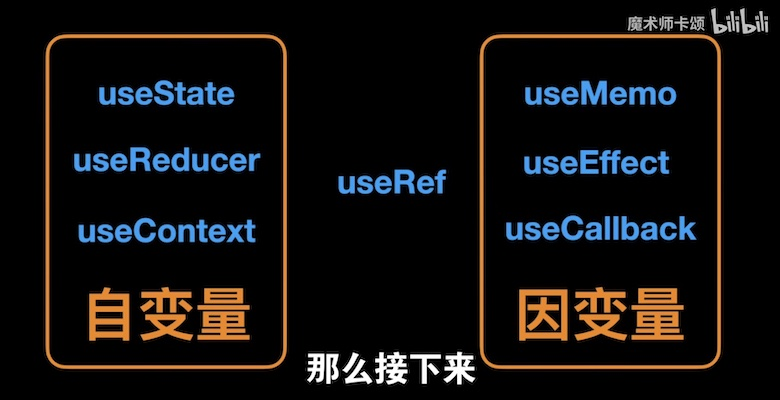
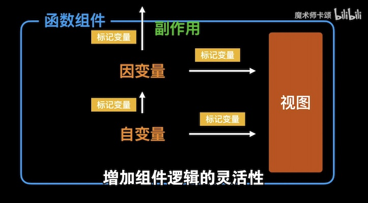

# React Hook

## Hook 思想

今天看到一个不错的视频，从自变量 - 因变量 - 标记变量的维度来介绍 hook，将常用的 hook 分为了三类：

1. 自变量 hook：
    - useState
    - useReducer
    - useContext
2. 因变量 hook：
    - useEffect
    - useMemo
    - useCallback
3. 标记标量：
    - useRef

其中把 `useRef` 称为标记变量的说法很有意思，因为它并不会自己主动改变，也不会因 state 的值而改变，而仅仅是在标记 render 过程中的值（例如标记 render 的次数 / render 至 DOM 上的节点等）。

视频中的图片展示的很清楚：





推荐看看原视频 [9分钟掌握React Hooks正确认知](https://www.bilibili.com/video/BV1JU4y1E73v)

## Hook 使用指南

### useRef

`useRef` 之所以名字中有 ref 是因为它经常用在 `<div ref={myRef} />` 的场景中，可以实现与 DOM 元素的绑定：

```jsx
function TextInputWithFocusButton() {
  const inputEl = useRef(null);
  const onButtonClick = () => {
    // `current` 指向绑定的 input 元素
    inputEl.current.focus();
  };
  return (
    <>
      <input ref={inputEl} type="text" />
      <button onClick={onButtonClick}>Focus the input</button>
    </>
  );
}
```

> 在 class 组件中，可以使用 `this.myRef = React.createRef();` 达到同样的效果

除了用于绑定 DOM 元素，`useRef` 还可以在函数式组件中实现 class 组件里属性的效果，做到在整个组件的生命周期保持值的一致性，并且在值发生改变时不触发组件的重新渲染。 例如在下面的代码中，用 `intervalRef.current` 记录计时器的 id，然后在组件清理阶段停止计时器：

```js
function Timer() {
  const intervalRef = useRef();

  useEffect(() => {
    const id = setInterval(() => {
      // ...
    });
    intervalRef.current = id;
    return () => {
      clearInterval(intervalRef.current);
    };
  });

  // ...
}
```

<Vssue title="React Hook" />