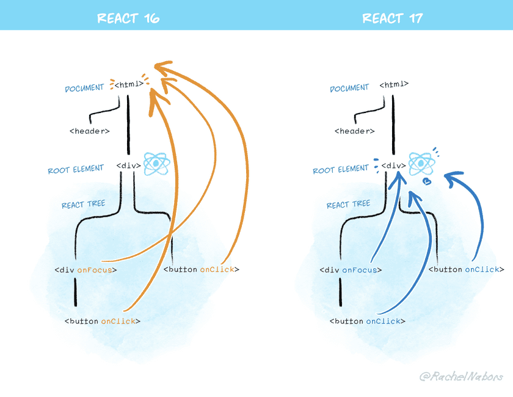

# React 升级变化

## React v17.0

React 在 2020.10.20 发布了 17.0 版本，这个版本没有带来任何面向开发者的功能特性，而是为了让以后的 React 版本升级更加简单，更具体一点就是**让不同版本的 React 在同一页面中并存变得更容易**（例如在新版本的 React 页面中，引用老版本的 React 组件）。

主要的变更有两点：

1. 事件委托机制
2. JSX 编译结果

### 事件委托机制的改变

在 React v16 及以前的版本中，对于绝大多数事件，会通过 `document.addEventListener()` 绑定在 `document` 这个页面唯一的根元素上。这样做有一个问题，就是当页面中如果使用了多个版本的 React 时，有可能**因为不同的版本采用了不同的事件处理方式，而导致互相有影响**。

为了解决这个问题，在 React v17 中，通过 `rootNode.addEventListener()` 将事件绑定在 `rootNode` 元素上，只要不同版本的 React 挂载的 `rootNode` 元素不同，就会天然形成隔离，从而避免影响。



### JSX 编译结果的改变

在 React v16 及以前的版本中，如果写下了如下的 JSX：

```jsx
import React from 'react';

function App() {
  return <h1>Hello World</h1>;
}
```

那么它会被转换成这样的 JS 代码：

```js
import React from 'react';

function App() {
  return React.createElement('h1', null, 'Hello world');
}
```

这样做存在的问题就是与 React 强绑定在了一起，必须在 JSX 的代码中写 `import React from 'react';`，如果不同的组件使用的是不同的 React 版本，那么在编译时就会很麻烦。

为了解决这个为题，在 React v17 中，可以直接写出如下的 JSX：

```jsx
function App() {
  return <h1>Hello World</h1>;
}
```

它会被被编译并自动插入依赖：

```js
// babel 编译自动插入
import {jsx as _jsx} from 'react/jsx-runtime';

function App() {
  return _jsx('h1', { children: 'Hello world' });
}
```

更多的升级变更，请参考 [React v17 升级说明](https://reactjs.org/blog/2020/10/20/react-v17.html)。

<Vssue title="React 升级变化" />
