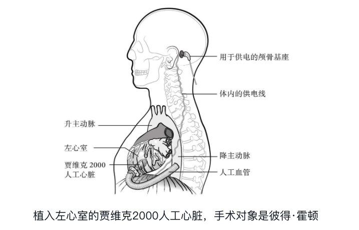

# 2021 读书笔记

## [消失的13级台阶](https://book.douban.com/subject/34996429/)

值得思考的一本推理小说，在推理之外，也融入了作者对死刑的许多思考。

在讨论死刑时，我们常常聚焦于被执行死刑的人，却忽视了死刑的执行官。书中作者从执行官这一视角出发，谈到了执行死刑对心理造成的巨大影响，进而引导读者思考死刑、乃至法律的正义性问题。

这本书不只是单纯讨论死刑的存废，作者也不是完全反对死刑，更多的内容大家可以亲自读一读进行探索。

<right-text>2021.10.22</right-text>

## [对伪心理学说不](https://book.douban.com/subject/6952036/)

今年读过的最好的一本书，强烈推荐👍

初看这本书的书名和封面，还以为是一本网红流行书，没想到整本书读完带给我巨大的惊喜。虽然是围绕着心理学展开，但实际上主题是科学。作者从什么是科学、可证伪性、相关关系和因果关系、概率性和偶然性等方面，比较全面地介绍了科学研究的特点，也在不知不觉中向读者阐述了批判性思维的重要性。

作为一本英文原版已经第 10 次出版的心理学导论教材而言，这的确是一本经典书籍，推荐给对科学思维感兴趣的大家。

<right-text>2021.09.27</right-text>

## [价值](https://book.douban.com/subject/35188914/)

看了前两百页实在是有些难以继续读下去了，一开始涉及到作者的学习历程，还非常务实，但是越往后就越虚，简直是“脱实入虚”的典范。

《价值》，没有什么价值。

<right-text>2021.09.23</right-text>

## [骆驼祥子](https://book.douban.com/subject/1043815/)

祥子，一开始是个年轻有干劲的小伙子，想着努力工作攒钱买一辆属于自己的车，但最后却变成了得过且过、混吃等死、丧失了精气神的一人。

一方面有社会的不幸，例如第一次买车后被军官抓走奴役，车没了、人也备受打击；另一方面也有祥子自身的原因，例如禁不住女色的诱惑、执拗的性格等等。不过任谁经历祥子的这样挫折，可能也不会表现的更好吧？对于我们普通老百姓而言，生活中的一些风雨很可能就造成人生轨迹的巨大变化。

人力拉车的场景生活中早就见不着了，所以祥子攒钱买车拉客人读来有一些陌生感，不过看到[一篇书评](https://book.douban.com/review/9144742/)，将买车变成了如今我们努力工作赚钱买房，读起来亲切了许多。

<right-text>2021.08.09</right-text>

## [微信背后的产品观](https://book.douban.com/subject/35339729/)

在微信十周年的时候，团队给我们每个人都发了这样一本书，很薄，很美，也很贵。

先不说书中的观点是否正确，光是有趣程度就让我忍不住称赞，小龙真是一如既往是个有趣的人 👍 

能够建立微信这么庞大的系统，并通过制定规则，让用户、商家、第三方开发者等在其中自我演化，想想就是让人激动。

<right-text>2021.07.22</right-text>

## [小岛经济学](https://book.douban.com/subject/26985299/)

内容本身还是挺有意思的，用小岛经济的发展讲述了一些基础的经济学原理，而且一些类比很贴近生活，容易理解。

不过作者本身的情感倾向过于明显，在文章中不少地方很直白地表述了对政府调节市场的反对，过于推崇自由市场主义，这对于科普作品而言并不是一件好事。

<right-text>2021.07.16</right-text>

## [清华韩秀云讲经济](https://book.douban.com/subject/33447344/)

在微信读书上偶然看见的一本书，读起来很快，一两小时就读完了，以通俗的语言分三块介绍了楼市、股市、汇市，作为科普读物而言的话还是挺合适。

股市、汇市这两块由于自己比较了解，所以没什么新的收获，就不多说。第一部分是关于楼市的，让我学到了一些基础的知识，例如：

- 中国的房屋买卖起源于 1998 年 7 月国家取消福利住房制度，实行住房分配货币化。
- 中国房地产市场的繁荣发展于 2003 年非典疫情后，当时国家出台的《国务院关于促进房地产市场持续健康发展的通知》，把房地产作为中国支柱性产业。
- 政府为何要调控楼市？由于房地产市场规模过大，政府担心泡沫刺破后引起连锁反应，导致经济掉头向下。所以政府调控的目的主要是为了控制金融市场风险。
- 房地产税相关
  - 征收房地产税主要是为了解决地方的财政收入问题，而不是为了打压房价。
  - 征税后可能会导致租金上升，最终还是会转嫁到租房人身上。
  - 政府征税需要考虑执行成本的问题，所以需要先建立一套较为完善的房屋价格评估系统，并处理好小产权房的问题。
  - 征收房地产税的初期可能会导致市场恐慌，房价短期下跌，但最终价格还是受供需关系影响。

<right-text>2021.06.24</right-text>

## [冬牧场](https://book.douban.com/subject/10522856/)

李娟的文字清新而又藏着诙谐，整本书不紧不慢地向我们描述了阿勒泰地区的居麻一家，冬季在牧场的生活。说实话，在读这本书之前，我连阿勒泰地区在哪儿都不知道，在百度地图上搜索找了半天，甚至还一不小心弄混了阿勒泰和阿泰勒（后者是青海省的一个县），最后才在祖国的东北角找到它，处在接近国境线的地方。

游牧的生活是陌生的，例如藏在地下的地窝子、用作燃料的羊粪。同时游牧的生活更是艰辛的，例如低于零下三十五度的天气，有时要走上几公里才能背回来三十斤的雪作为水源。不过总会有着令人开心的事情，例如冬宰时的丰盛大餐、牧民之间的串门（说是串门，实际也隔着好几公里，得走上大半天）。

虽然李娟仅仅揭开了牧民生活的一角，但是其中的艰辛与温馨却已令我记忆深刻。从书中了解到，不久这片牧场就会封闭起来退耕养草，牧民们迁移到定居点生活。作为读者，不知该可惜还是该庆祝，但或许就像书中收牲畜的人所说的“定居当然好，但哈萨克都完了！”。

<right-text>2021.05.22</right-text>

## [刘擎西方现代思想讲义](https://book.douban.com/subject/35313227/)

这是一部非常优秀的科普作品，作者刘擎是华东师范大学教授、奇葩说的导师。整本书可以分为两个部分，第一部分涉及人类的“心灵生活”，第二部分则有关“公共生活”。由于本书是由讲稿整理而来，所以作为小白的我阅读起来也基本没遇到什么障碍，阅读体验非常不错。

第一次读完之后，发现有些地方似懂非懂，于是又花了两天的时间重读了一遍，整体来说主要由两点收获：

1. **消除误解**：有一些传播比较广的、来源于哲学家的用语其实偏离了原意，例如“上帝死了”、“他人即地狱”、“存在即虚无”等等，通过阅读这本书可以帮助我们了解他们的原意，厘清背后的思想。
2. **思想遨游**：跟随作者的脚步，了解各位现代哲学大师的核心思想，例如韦伯的工具理性和价值理性、弗洛伊德的精神分析学说、萨特的“自由选择是一种沉重的负担”、波普尔的可证伪性与批评理性主义、伯林的消极自由与积极自由、罗尔斯的无知之幕等等。虽然说由于科普文章的局限性，无法深入的了解某一具体思想，但是整本书读下来能看到这些思想的演变与发展，极大的拓展了个人视野。

<right-text>2021.05.10</right-text>

## [被讨厌的勇气](https://book.douban.com/subject/26369699/)

在公司内部的 BBS 上被推荐了好几次的书，然而看完之后有一些失望，书中的结论的确是有可取之处，例如认为主观性的解释而不是客观性的事实决定了人的感受、要学会进行课题分离等等，然而读完收获并不大，一方面是作者借由哲人进行的论述缺乏逻辑性，可能是由于采用对话体的原因，哲人经常转移话题，以个例反对个例；另一方面则是作者过于强调人主观态度的重要性，对于客观环境因素的影响常认为不足以重视，认为环境无法改变而主动接纳则可，未进行更进一步分析，有些理想化。

书中的部分结论是科学的，值得学习的，有些观点也很有启发性，但是参杂着一些过分绝对化的观点则让读者阅读起来非常难受（例如应该无条件信赖别人等），或者当人处于低谷的时候，这种行文可以给人以力量，但从批判性、逻辑性上来讲则差了一些。

<right-text>2021.04.18</right-text>

## [那个特别的疯子](https://book.douban.com/subject/30258719/)

在图书馆偶然看见的一本书，作者 A.F.布雷迪是一名心理医生，整本书也是围绕着心理医生拯救病人与医生自己被病人拯救展开。

说实话书中描写的许多情节都离我的生活比较遥远，例如酗酒、吸毒、家暴、滥交等等，所以读起来难以产生共情。不过故事本身还是挺好的，能让读者瞥见心理医生工作的日常，也通过巧妙的叙事方式讲述了发生在奶奶、父亲、母亲、女儿三代人之间关于“边缘性人格障碍”的故事。

总的来说，在周末花一天的时间阅读这本书的体验还是很不错的。

<right-text>2021.04.11</right-text>

## [JavaScript 设计模式与开发实践](https://book.douban.com/subject/26382780/)

这本书是 2018 年 1 月份在腾讯实习时买的，三年多过去了，最近终于把它翻出来读完了，

本书作者曾探是腾讯的高级技术专家，书中的内容的确如书名反应的一样，非常注重结合开发实践，会通过实际的例子讲解具体的设计模式，在读过的中文技术书籍中质量可以算是前 10% 了，强烈推荐。

这本书写在 2015 年，当时 TypeScript 还不太成熟，现在六年过去了，TypeScript 的应用已经越来越普及，有机会的话，非常期待作者结合它再来讲讲，再出个第二版。

<right-text>2021.04.10</right-text>

## [自私的基因](https://book.douban.com/subject/30309613/)

《自私的基因》在 1976 年首次出版，距今虽已经过去了 45 年，但当我读完此书，仍然感觉收获颇多，经典的魅力实在是让人着迷。

书中让我印象深刻的主要有四点：

1. **利他行为的本质仍是自私**：动物发出响声向同伴警告危险，但自己承受暴露的风险等行为，虽然表面上看是利他的，但本质上是为了扩散基因，虽然自己做出了一些牺牲，但追求的是自己基因的延续，所以说出发点仍然是自己的利益最大化。
2. **衰老基因逃过了繁殖过滤**：有一些基因让个体在年轻时身体就出现异常导致无法存活，那么它们就无法通过繁殖传递给子代，也就是说它们被“繁殖过滤”了。同样的，也会有一些基因让个体在年老时身体才出现异常，那么此时个体已经完成了繁殖，这些基因得以在子代身上传递，也就是说它们逃过了“繁殖过滤”，因而这类基因会在基因库中持续存在，也许这就是人类寿命有限的原因。
3. **文化 meme 传播本质上与基因传播相同**：文化 meme 是作者道金斯原创的一个概念，用于指那些在人群中广泛传播的概念，曾被译为觅母、模因等，比较传神的一个翻译是“梗”。道金斯认为文化 meme 传播与基因传播具有相同的本质，是放之宇宙皆准的演化模式，它们都具有传播性（从一个大脑转移到另一个大脑）、变异性（传播的过程中每个人的理解都存在差异)、选择性（不同的梗传播能力各不相同）这三大特征。
4. **进化稳定策略**：在一个种群当中，每个个体采取的各种策略比例总是在摇摆中达到平衡，而且最好的策略取决于种群中的大多数在做什么。例如在一个种群中一开始只有互帮互助的策略（你帮助我，我以后也会帮助你，而且被帮助的收益大于帮助其他个体的付出），假如有一个个体突然采取了自私策略（你帮助我，但是我不会帮助你），它在无需付出的情况下可以获得和其他个体相同的好处，那么它在与族群中中就获得了竞争优势，导致采取自私策略的个体越来越多。但当大部分都采用了自私策略之后，它们无法从其他个体中获得帮助，反而互帮互助的个体可以彼此增加收益，导致采用自私策略的个体又相对减少，最终达到一个相对的平衡。

需要注意一点的是，本书的内容很多，作者道金斯的文笔也比较严谨，又加之经过了译者的翻译，导致阅读起来不是那么顺畅，实不相瞒，书中的一些内容有时我也会选择跳过。不过瑕不掩瑜，这本书是我今年以来读过最棒的一本，强烈推荐👍

<right-text>2021.04.06</right-text>

## [投资最重要的事](https://book.douban.com/subject/10799082/)

本书的作者 Howard Marks 是美国橡树资本管理有限公司创始人，整本书从“道”的层面，简述了投资中需要关注的地方，包括第二层次思考、价格与价值的关系、理解风险、钟摆意识、耐心等待机会等。其中最让我印象深刻的有两点：

- 投资市场遵循钟摆式摆动，常处于定价过高与定价过低之间，而且自端点摆回的速度通常更快。
- 等待投资机会到来往往好于追逐投资机会，我们永远不必急着挥棒，因为投资失败的风险远大于失去一个获利机会的风险。

不过想要让“道”发挥作用的前提是学会能够驾驭它的“术”，在投资中也就是掌握能够评估内在价值的方法，这对于我们普通的散户投资者而言意味着需要花费不少的时间进行学习，而且往往得出的结果也不一定可靠，所以个人觉得投资指数基金或者优秀的主动基金，获取一个与市场平均收益差不多的结果是一个性价比不错的方案。例如对于沪深 300 指数，2004.12.31 起点是 1000 点，当前 2021.03.21 是 5007 点，粗略估算年化收益率是 10.4%（取 16.25 年），已经非常诱人了。

<right-text>2021.03.21</right-text>

## [零售的哲学](https://book.douban.com/subject/26270679/)

这本书是由日本 7-ELEVEN 的创办人铃木敏文先生在 2014 年底出版的，挺薄的一本书，在微信读书上两个小时就可以读完。

书虽薄，但是书中的内容很有趣，作者一开始虽是零售业的门外汉，但是凭借着自己惊人的洞察力和从消费者角度出发进行的思考，逐渐带领着 7-ELEVEN 成为日本最大的便利店集团。作者提出的密集部署门店、建立单品管理、捕捉用户需求、积极应对变化等理念都非常值得学习。

不过也要辩证地看待书中作者的观念，虽说 7-ELEVEN 在日本取得了巨大的成功，但是在中国的发展却一直比较缓慢，说明还是存在一定的局限性。

<right-text>2021.03.05</right-text>

## [文明、现代化、价值投资与中国](https://book.douban.com/subject/34997975/)

初看书名，我对书的内容有许多期待；读完序言，不禁感叹作者非常厉害，心中期待又更深了些。然而“期望越大，失望越大”，读着读着，会发现作者一些结论下得过于武断，而且下半部分有许多重复的内容，可以看出并没有经过很好的编排，只是简单地将作者历年的讲稿做了收集，同时讲稿的内容说实话也缺乏新意，基本上是常见的观点。

这本书与黄奇帆所作的 [《分析与思考》](https://book.douban.com/subject/35149551/) 形成了鲜明的对比，同样是讨论中国，同样是讲稿的合集，相比之下，[《分析与思考》](https://book.douban.com/subject/35149551/) 出色太多。

<right-text>2021.03.03</right-text>

## [Head First 设计模式](https://book.douban.com/subject/2243615/)

在我读过的所有计算机类书籍当中，Head First 系列一直都未曾让我失望，这本书也维持了该系列的一贯水准——诙谐幽默的语言、精美有趣的插图、循循善诱的讲解，总而言之本书通过各种方式激活读者大脑，不仅读起来非常有趣，而且能在不知不觉中将知识传授给读者。同时本书的内容编排上也非常用心，讲究前后呼应，在讲解后面的设计模式章节时，也会将之前的内容拿来进行对比，非常有利于读者的理解与记忆。

话不多说，如果想入门设计模式的话，那么这本书一定适合你！

## [手把手教你读财报](https://book.douban.com/subject/35299355/)

在 2021 牛年春节期间，花了几天的时间读完了这本书。内容正如书名描述的，主要是作者唐朝，以贵州茅台 2013 的财报为例子，带着读者一步步学会如何阅读财报。读的过程中感觉收获了不少知识点，也做了很多笔记，但是读完之后一回顾，又觉得脑袋中一团乱麻，似乎什么都没记住。究其原因，是这本书中的内容太丰富了，想要在短短几天时间之内读完并牢牢掌握是不可能的，目前的我只能说是通读了一遍，算是有了个大致的印象，后续还需要通过不断地阅读财报，反复翻阅这本书来实现消化吸收。

读完这本书，虽说尚未完全掌握，但是也可以立下一个 Flag：以后不论是买基金还是股票，在操作之前都应先阅读其财报，这样才是对自己负责，是根据自己的思考做出的判断。

<right-text>2021.02.18</right-text>

## [分析与思考](https://book.douban.com/subject/35149551/)

本书的作者是黄奇帆教授，曾在上海工作 33 年，后来也担任过重庆市长，在重庆市任职期间，通过“地票制度”开放供应土地，同时提供大量公租屋，有效地将重庆房价保持在了较低水平。这本书是他自 2018 年 11 月起，两三年间在复旦大学所做讲座的合集，涉及到宏观调控、货币政策、资本市场、房地产政策、对外开放、中美经贸六个主题。

读完整本书最大的感受就是：政府领导层对于发展中的热点问题，非常清楚地知道其产生的原因，了解历史上其他国家的应对策略，也有提出长期性、多维度的解决方案，可以说对于整个国家的宏观发展，政府是有着清晰的认知和详尽的规划。在读这本书之前，我很容易因为生活中的困难而抱怨政府，例如房价过高、不允许大量兑换美元、资本市场混乱等等，认为是政府的不作为或者是管得太宽。现在读完这本书，我依旧会因为这些问题而心生不悦，但是会多一份期待，期待着国家能按既定的蓝图一步步走下去，能实现书中所说的提供人均 20 平米的公租房、货币在资本项下能自由兑换、完善上市公司注册制和退市制度等。

虽说在实现美好未来的过程中，必定会遇到许多困难，但是我依旧相信着这一天一定会到来，相信着更幸福的生活就在前方。 

<right-text>2021.02.08</right-text>

## [1984](https://book.douban.com/subject/4820710/)

《1984》由 George Orwell 在 1949 年出版，和《美丽新世界》、《我们》并称为反乌托邦三部曲。本书中，作者通过“温斯顿”的视角，描述了在高度集权国家 —— “大洋国”的生活状态：人民群众非常穷苦，只能基本满足生活需要，而独裁者老大哥高度集权，通过电屏（一种类似监视器的设备）监控每一个人，同时国家整日处于和其他国家的战争状态，利用战争和仇恨，保持民心的凝聚。

在大洋国中，整个社会被分为了上、中、下三个阶级，上层的政府通过密切监视、发动战争、散播仇恨、简化语言、篡改历史、压抑本能的方式，实现了对中层党员的思想控制，令其无造反的可能。而对于底层的人民群众，政府则认为他们只需干活、繁衍，别的行为则无关紧要，因为他们贫穷而无知，不会觉醒也缺乏组织。

读来最令我害怕的有两点，一是对历史的篡改，例如当党对事情预测出现了错误的时候，会对书籍、报纸等记录进行销毁与修改，让其看起来是成功做出了预言，又例如当某个人犯了错误的时候，就会在所有的纸质材料中被除名，像是从未存在过一样。当历史可以被随便篡改，如何能保证我们对过去的了解是正确的呢？如何能判断我们是比以前过的更好或是更差了呢？另外一点让我害怕的则是对语言的简化，人的思维和表达都是受限于语言的，当语言本身被简化之后，使用语言的我们也难免会受到影响。假如整个语言被删减至只能表达基本的生活需要，那我们是否还能进行复杂且富有逻辑的思考呢，或者是否能准确讲述内心的想法呢？

作为中国人，可以从《1984》中看到许多预言在文革的十年内真实发生了，希望能以史为镜，避免重蹈覆辙，让大家奔向更美好、更自由的生活。“多一个人读《1984》，这世界上就多了一个自由的灵魂”，这的确是一本值得多读的佳作。

<right-text>2021.01.27</right-text>

## [投资中最简单的事](https://book.douban.com/subject/35000951/)

这本书的作者是[高毅资产](https://www.gyasset.com/p/site/index)的董事长邱国鹭先生，虽然整本书按照投资理念、投资方法、投资风险和投资心理学分为了四部分，但是其实都是在围绕着 *“价值投资”* 的思想进行解读。

对于价值投资，可以发现大部分书讲的观点都是类似的、相通的，每读一次都能警醒自己不要过于在意公司股价短期的波动，而应着眼于对公司内在价值的关注。正如书中所说，我们应该多关注于静态的、本质的信息，例如核心竞争优势、行业竞争格局等；而不要被动态的、暂时的信息，例如政策打压、订单超预期等过分吸引注意力。

另外在 2021 年 1 月这个时间点，上证指数再一次突破 3600 点，市场情绪进一步被点燃，作为投资者该进行怎样的选择呢？书中 *“投资心理学 - 人性的弱点”* 这一节非常有意思，大部分也的确在我自己身上得到了印证，希望能引以为戒。

除了这些优秀的地方，可以明显感受到不好的一点是后半部分有些章节似乎有拼凑之疑，不少词句都可以在前文中找到一模一样的内容，虽然瑕不掩瑜，但要是能在内容编排上完善下就更好了。

<right-text>2021.01.17</right-text>

## [打开一颗心](https://book.douban.com/subject/30277179/)

这本书可以看做是著名的英国心外科医生 [Stephen Westaby](https://en.wikipedia.org/wiki/Stephen_Westaby) 的自传，记录了其从医五十多年的过程中十六个经典的案例，作者的文笔传神，读来让人身临其境：当手术进入关键时不由自主变得紧张，当病人成功恢复时也随之高兴，当病人不幸去世时感到难过与伤感。

其中有两个病人让我印象非常深刻：

- 安娜的心脏中反反复复长了七个黏液瘤，总过经历了五次心脏手术，遭受了巨大的折磨，往往是刚做完一次手术摘除了肿瘤，过几年又会长出新的。在最后一次成功完成手术后，她决定采取鸵鸟政策，再也不做超声心动图进行检查了。还好这一次幸运之神眷顾了她，从此健康生活了十多年没有复发。

- 彼得·霍顿患上了扩张型心肌病，已经病入膏肓，自身的心脏就快承受不住，也不适合接受心脏移植，所以当时全部的希望就是安装新型人工心脏 —— *贾维克 2000*，它只有大拇指大小，每分钟能旋转一万次，泵血 5 L。不过不同于传统的人工心脏，贾维克 2000 并不搏动，也就是说并不会产生脉搏。另外有意思的一点是：传统的人工心脏会选择从腹部导出电线，不过这样的话无法有效固定，容易由于摩擦导致感染，所以这一次选择了固定在头骨上，非常的科幻：

看完这本书不仅让我深感医生的伟大，他们一次次将患者从死神的手边抢下，而且也感叹于技术的进步，多亏了*贾维克 2000*等新技术的诞生，才挽救了许多传统手术无力回天的病人。

在书的末尾，作者表达了对“公布外科医生手术的死亡率”这一政策的反对。这是一个值得深思的政策，一方面作为病人肯定是希望选择死亡率低的医生，但是另一方面也会促使医生去选择低风险、小难度的手术，那么这样一来是否就会导致对于有风险、难操作的手术，没有医生愿意挺身而出呢？

<right-text>2021.01.07</right-text>

<Vssue title="2021 读书笔记" />
