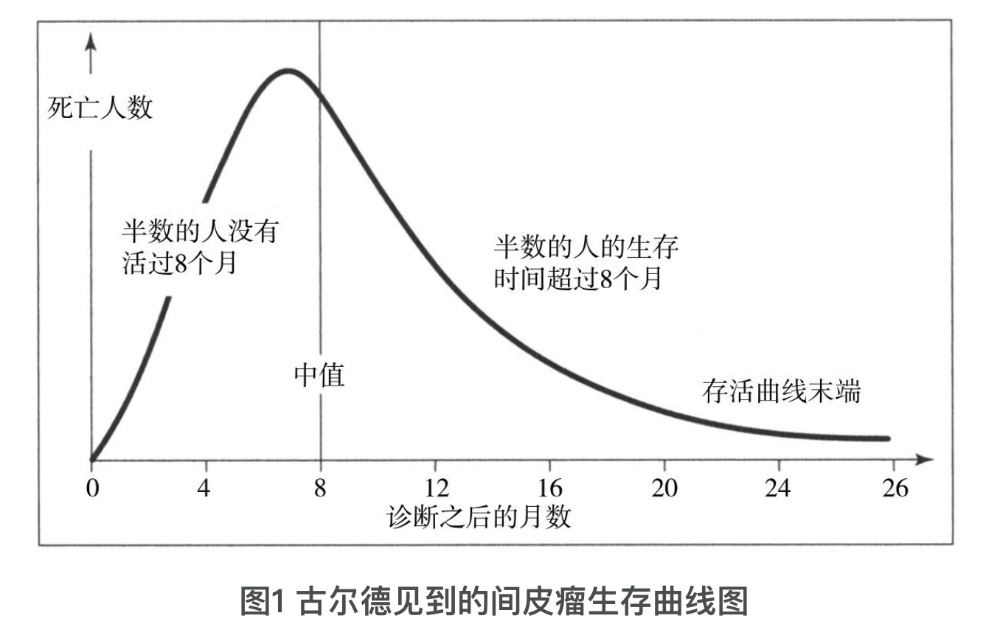

# 2022 读书笔记

## [每个人的战争](https://book.douban.com/subject/27131873/)

<Rating :rating="3" />

作者是一名英国医生，同时也是一名脑癌患者，从亲身经历出发，讲述了如何更好的面对癌症，主要包括了情绪、环境、饮食和锻炼四个方面。

书中第二章“逃生统计学”的一个案例让我印象深刻，Stephen Jay Gould 是哈佛大学的动物学教授，进化论方面的专家，在 40 岁的时候发现自己患上了间皮瘤癌症，根据如下图的历史统计数据来看，存活时间的中值是8个月。

不过 Stephen Jay Gould 从三个方面推断他可以活的更久：

1. 他不抽烟、不喝酒，身体很棒（除了癌症），而且是在间皮瘤早期被确诊。
2. 虽然半数病例的存活时间在 0-8 个月，但是也有超过一半的病例存活时间超过 8 个月，而且有一些存活时间大于 2 年。
3. 图中数据来源于 10 年前的统计，而肿瘤的治疗手段在不断发展，他现在借助于新的治疗手段，有更大的希望可以活的更久。

最终他 20 年后(2002 年）死于其他疾病，在 1991 年的时候写了一篇散文 [中值不是死亡的信使](https://journalofethics.ama-assn.org/sites/journalofethics.ama-assn.org/files/2018-05/mnar1-1301.pdf)。

数据是客观事实，但是如何结合自身情况用动态发展的眼光解读数据却是每一个人的主观选择。

另外书中也有许多营养学相关的内容，推荐了些抗癌食物，例如绿茶、鱼肉、有机蔬菜等等，不过这方面各种学说都有，推荐阅读[《饮食的迷思》](https://book.douban.com/subject/30437166/)这本书获取更全面的知识。

<right-text>2022.01.23</right-text>

<Vssue title="2022 读书笔记" />