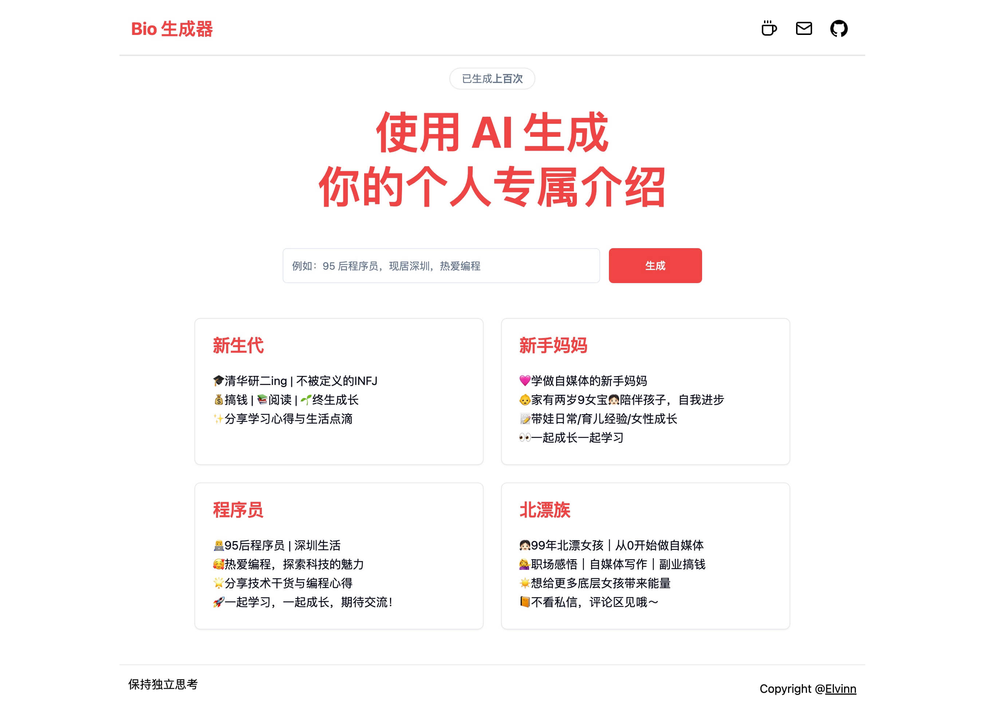
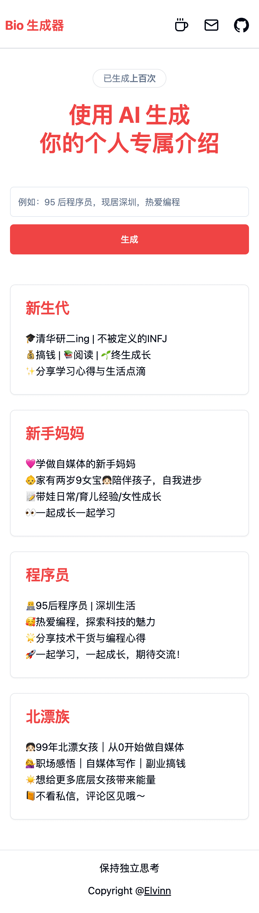

# 个人简介生成器

[个人简介生成器](https://bio.elvinn.wiki/) 是一款借助 AI，通过一句话描述，能自动生成小红书 emoji 风格个人简介的工具，支持电脑端和移动端。

## 电脑端预览



## 手机端预览



## 技术栈

项目地址： [Github - bio](https://github.com/elvinn/bio)

- AI
  - 豆包大模型
  - [Vercel AI SDK](https://www.npmjs.com/package/ai)
- 前端
  - React
  - Next.js
  - Tailwind CSS
  - 组件库 Shadcn UI
  - 图标库 lucide-react
- 后端
  - Next.js
  - @vercel/postgres

## 技术收获

### 开发 AI 应用的体验如何？

第一次进行简单的 AI 应用开发，整体非常顺畅，体验很不错，核心的流程如下：

1. 接收用户的输入，例如一小段话；
2. 将用户的输入结合系统预设的内容，做为 Prompt（提示语） 发送给 AI 模型；
3. 将 AI 模型返回的结果展示给用户。

其中的关键在于**找到一个适合使用 AI 的应用场景**，能让 AI 模型帮助用户解决问题，实实在在的带来价值，而不是为了使用 AI 而使用 AI。

### 开发 AI 应用有什么工具可以使用？

现在 AI 应用开发非常火爆，业界也有不少工具可以拿来使用，例如 OpenAI 官方就提供了 [OpenAI Node API Library](https://www.npmjs.com/package/openai)，只需要传入指定的 AI 模型、提示语以及 API 密钥，就可以获取 AI 模型返回的结果，一个简单的例子如下：

```ts
import OpenAI from 'openai';

const client = new OpenAI({
  // This is the default and can be omitted
  apiKey: process.env['OPENAI_API_KEY'],
});

async function main() {
  const chatCompletion = await client.chat.completions.create({
    messages: [{ role: 'user', content: 'Say this is a test' }],
    model: 'gpt-3.5-turbo',
  });
}
```

::: tip
由于 Open AI 接口已经成为了事实上的行业标准，所以像字节豆包、Kimi 等 AI 模型提供的接口兼容 Open AI 的接口协议，所以也可以通过 OpenAI Node API Library 进行调用，只需要将 `process.env.OPENAI_BASE_URL` 设置成对应的模型接口地址即可，例如调用字节豆包的 AI 模型时设置成 `https://ark.cn-beijing.volces.com/api/v3/` 即可。
:::

我一开始也是使用的 `openai` 这个 npm 包，但是后来发现 [Vercel AI SDK](https://www.npmjs.com/package/ai) 更加方便，它能很便捷地处理 AI 的流式响应，其中主要涉及：

- [AI SDK Core](https://sdk.vercel.ai/docs/ai-sdk-core)：对于不同的 AI 模型接口提供了统一的 API 封装，用于在 Node 端调用 AI 模型。
- [AI SDK UI](https://sdk.vercel.ai/docs/introduction)：提供了 `useCompletion` / `useChat` 等 React Hooks 用于 AI 流式响应的处理。

具体的代码这里就不列出来了，可以点击上方的官方文档查看。

### 使用 Next.js 的 Server Actions 体验如何？

`Server Actions` 是由 Next.js 从 13 版本开始引入的一个功能。它允许我们在 Next.js 应用中直接从客户端组件调用服务器端函数，而无需创建 API 路由。

一开始使用 Next.js 的 Server Actions 时，发现它的使用体验非常好，只需要通过 `use server;` 指令定义一个 `action` 函数，然后在前端调用函数即可，非常方便，整体来说有如下几个优点：

1. **简化代码**：无需创建专门的 API 路由，直接像普通的异步函数一样定义然后调用即可。
2. **类型安全**：可以在客户端和服务端共享类型定义，类型提示非常友好。
3. **提高安全性**：敏感逻辑放在服务端，返回给客户端的只有渲染后的结果。
4. **不依赖客户端 JavaScript**：哪怕客户端禁用了 JavaScript，也能正常调用服务端函数。

在整个开发过程中，**简化代码** 和 **类型安全** 带来的体验提升非常明显，但是它的学习曲线和理解成本也比较高，并且由于和 Next.js 紧紧绑定在了一起，所以假如将来要进行迁移的话，改造成本会非常大。

最终在这个项目中，还是采用了传统的 API 路由方式，因为它的使用成本更低，并且可以和其他的框架进行自由的集成。

### 使用 Shadcn UI 组件库的体验如何？

Shadcn UI 提供了一种很新颖的开发方式，它并不是直接安装一个 npm 包，而是通过 `npx shadcn@latest add button` 这样的方式，将组件按需复制到项目的源代码中，然后进行自定义修改，整体体验非常好，有如下优点：

1. **主题高度可定制**：由于是基于 CSS 变量开发，所以可以很方便地进行主题定制，只需要修改 CSS 变量即可改变主题的颜色等，也可以直接通过官方提供的工具 [themes](https://ui.shadcn.com/themes) 进行定制。
2. **文档详细**：提供了详细的文档，包括组件的使用方法、示例代码等，非常方便学习和使用。

总体来说，Shadcn UI 提供了一种灵活和可定制的开发体验，虽然它的更新维护成本会高一些（因为不使用 npm 进行版本管理），但是非常适合这种小的个人项目。
