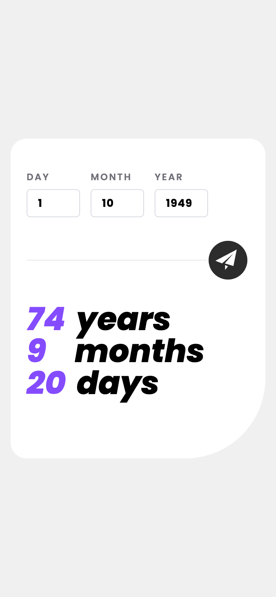
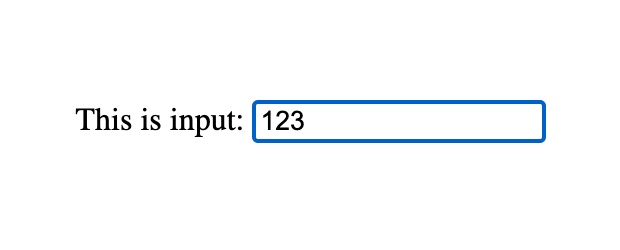

# Date Calculator

[Date Calculator](https://date-calculator.elvinn.wiki/) 是一个简单的日期计算器，能计算过去或者将来的日期距离当前时间的年、月、日，支持电脑端和移动端。

## 电脑端预览


## 手机端预览



## 技术收获

### 若使用特殊字体，在字体资源加载完成时，页面文字发生闪烁该怎么办？

虽然使用特殊字体可以满足设计的要求，但是字体资源的加载需要额外的耗时，容易出现 **FOIT**（flash of invisible text，文字由不展示突然变成成特殊字体） 或者 **FOUT**（flash of unstyled text，文字由默认字体突变成特殊字体） 两种闪烁的情况。

**FOIT** 的示意如下图所示，可以看到一开始不展示文字，待字体文件加载成功后再展示了特殊字体：


**FOUT** 的示意如下图所示，可以看到一开始展示的是默认字体，待字体文件加载成功后再切换成了特殊字体：


这些行为可以通过 CSS 中的 `font-display` 字段进行控制，它有 5 个可选的值：

| 可选的值 | 屏蔽期（Block Period） | 交换期（Swap Period） |
| -------- | ---------------------- | --------------------- |
| auto     | 取决于浏览器           | 取决于浏览器          |
| block    | 2-3 秒                 | 无限长                |
| swap     | 0                      | 无限长                |
| fallback | 100 毫秒               | 3 秒                  |
| optional | 100 毫秒               | 0                     |

为了正确使用 `font-display` 字段，需要了解字体加载周期的两个阶段：

- **屏蔽期（Block Period）**：从开始请求字体文件开始计算。在屏蔽期内，如果字体未加载完成，对应的文字将会不展示；若屏蔽期结束字体仍未加载完成，则用默认字体展示。

- **交换期（Swap Period）**：从屏蔽期结束时开始计算。在交换期内，若特殊字体加载完成，则页面内容会切换成特殊字体。

为了选择合适的值，我们可以考虑如下策略：

- **如果优先考虑性能**：使用 `font-display: optional`，这样可以保证文字渲染延迟不超过 100 毫秒，而且文字布局不会发生变化。
- **如果需要快速显示文字，而且仍想使用特殊字体**：使用 `font-display: swap`。
- **如果需要保证展示效果，确保使用特殊字体展示**：使用 `font-display: block`。

::: tip

1. Date calculator 使用的是 `font-display: fallback`，希望当网络较好时，用户能直接看到特殊字体的效果；当网络较差或者字体加载失败时，用户能快速看到网站内容（哪怕使用默认字体）。
2. Google Fonts 默认使用的是 `font-display: swap`。

:::


参考资料：

1. [MDN - font display](https://developer.mozilla.org/zh-CN/docs/Web/CSS/@font-face/font-display)
2. [CSS Tricks - font display](https://css-tricks.com/almanac/properties/f/font-display/)
3. [web.dev - font best practice](https://web.dev/articles/font-best-practices?hl=zh-cn)

### 给 input 元素设置了边框，但是在输入时不生效怎么办？

在 Chrome 等浏览器中，当 `<input />`、`<textarea />` 等标签处于输入状态时，会默认有蓝色的样式：



这是因为浏览器默认设置了 `:focus-visible { outline: -webkit-focus-ring-color auto 1px; }`，我们可以通过设置 `input { outline: none; }` 来进行样式重置。

### 使用 tailwind 时，如何设置主题色？

可以在 `tailwind.config.js` 中的 `theme.entend` 字段进行自定义，例如：

``` js {8-12}
/** @type {import('tailwindcss').Config} */
export default {
  content: [
    "./index.html",
    "./src/**/*.{js,ts,jsx,tsx}",
  ],
  theme: {
    extend: {
      colors: {
        "primary-color": "hsl(259, 100%, 65%)",
      },
    },
  },
  plugins: [],
}
```
