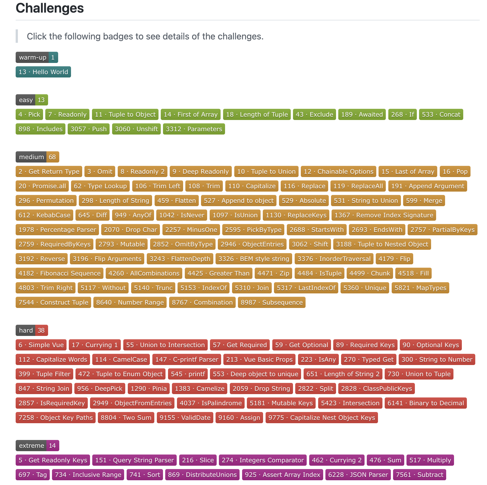

最近在 Github 上发现了一个有趣的项目 [type-challenges](https://github.com/type-challenges/type-challenges "type-challenges")，它是 TypeScript 类型体操姿势合集，提供了常用的一百多个工具类型 playground，可以让我们像玩游戏一样进行通关大挑战。



其中有一些是 TypeScript 内置的工具类型，例如 [`Pick / Readonly / Exclude`](https://www.typescriptlang.org/docs/handbook/utility-types.html "`Pick / Readonly / Exclude`") 等，剩余绝大部分则是一些常用但未官方实现的，例如 `Deep Readonly / Trim / Capitalize` 等。

笔者计划每周实现 3-6 个工具类型，并通过文章沉淀分享，顺利的话 6 个月可以通关完成，希望通过这一系列的挑战，能加深我和大家对 TypeScript 的理解，也欢迎大家多多监督 😄。

## 1. 实现 Pick

### 挑战内容

实现 TypeScript 内置的 `Pick<T, K>`，从类型 T 中选择出属性 K，构成一个新的类型，例如：

```ts
// TODO: 补充 MyPick 代码
type MyPick<T, K> = any;

interface Todo {
  title: string
  description: string
  completed: boolean
}

type TodoPreview = MyPick<Todo, 'title' | 'completed'>

const todo: TodoPreview = {
    title: 'Clean room',
    completed: false,
}
```

> 知识点：`keyof / in / extends`。

### 题目解析

为了从类型 T 中挑出属性，我们可以使用 `keyof` 获取对象全部的键名，例如：

```ts
interface Student {
  name: string;
  age: number;
}

type StudentKeys = keyof Student;
// StudentKeys: 'name' | 'age'
```

通过 `keyof` 获取到的 `'name' | 'age'` 这样通过 `|` 分割的类型集合，称之为**联合类型（union type）**，表示取值可以为多种类型中的一种。

联合类型的继承比较独特，例如 `name` 算是继承于 `'name' | 'age'`，而不是相反，更多例子可以参考如下代码：

```ts
type X = 'a' | 'b' | 'c';
type Y = 'a' | 'b';
type Z = 'a';

type isZExtendsY = Z extends Y ? true : false;
// isZExtendsY: true

type isYExtendsX = Y extends X ? true : false;
// isYExtendsX: true
```

同时，对于联合类型，可以通过 `in` 取它可能的值，从而构建一个对象：

```ts
type nameKeys = 'firstname' | 'lastname'

type FullName = {
  [key in nameKeys]: string;
}
// FullName: { firstname: string, lastname: string }
```

### 题目答案

了解了 `keyof / extends / in` 三个关键词的作用后，题目就比较简单，可以做出如下答案：

```ts
type MyPick<T, K extends keyof T> = {
  [P in K]: T[P]
}
```

## 2. 实现 Readonly

### 挑战内容

实现 TypeScript 内置的 `Readonly<T>`，接收一个泛型参数 T，并返回一个完全一样的类型，只是所有属性都会被 readonly 所修饰。

也就是说不可以再对该对象的属性赋值，例如：

```ts
// TODO: 补充 MyReadonly 代码
type MyReadonly<T> = any;

interface Todo {
  title: string
  description: string
}

const todo: MyReadonly<Todo> = {
  title: "Hey",
  description: "foobar"
}

// 报错，不能对 readonly 字段重新赋值
todo.title = "Hello";
```

> 知识点：`keyof / in / readonly`。

### 题目解析

和第一题 **实现 Pick** 比较类似，都需要遍历对象的属性，所以可以想到使用 `in / keyof`，不过新增的 `readonly` 先介绍一下。

`readonly` 的功能如同其名，让它修饰的变量无法被改变：

```ts
interface Student {
  readonly name: string;
  age: number;
}

const elvinn: Student = {
  name: 'elvin',
  age: 26,
};

// 错误，不能修改 readonly 属性
elvinn.name = 'elvinnnn';

// ok
elvin.age = 27;
```

常常被讨论的一个问题是 `const` 和 `readonly` 有什么区别？我认为主要是两点差异：

|          | 作用对象 | 检查机制          |
| -------- | -------- | ----------------- |
| const    | 变量     | 编译 & 运行时检查 |
| readonly | 属性     | 仅编译时检查      |

另外还有一个需要注意的地方就是数组的场景，在如下的代码中，虽然声明了 `const array`，但实际上还是能对 array 的内容进行修改，不变的只是它不能指向其它数组：

```ts
const array = [1, 2];

array[0] = 0;     // ok
array.push(3);    // ok
array = [1];      // 错误，不能指向其它数组
```

如果不希望数组的内容发生修改的话，可以使用 `readonly` 或者 `as const`：

```ts
const array1: readonly number[] = [1, 2];
const array2 = [3, 4] as const;

array1[0] = 0; // error
array2.push(3); // error
```

### 题目答案

通过 `in / keyof` 遍历对象属性，再使用 `readonly` 修饰属性使其不可变，所以答案如下：

```ts
type MyReadonly<T> = {
  readonly [key in keyof T]: T[key]
}
```

> 注意：不论是 `MyReadonly`，还是 TypeScript 内置的 `Readonly`，都只是对第一层属性生效，而对于内部深层次的属性，并不会生效，大家可以想想怎么实现 `Deep Readonly`，我们后续会进行挑战。

```ts
interface Foo {
  bar: {
    time: number;
  };
}

const foo: Readonly<Foo> = {
  bar: { time: 0 }
};

// ok，修改 bar.time 不会报错
foo.bar.time = 1;
```

## 3. 元组转换为对象

### 挑战内容

传入一个元组类型，将其转换为对象类型，这个对象类型的键/值都是从元组中遍历出来，例如：

```ts
// TODO: 补充 TupleToObject 代码
type TupleToObject<T extends readonly any[]> = {};

const tuple = ['model 3', 'model Y'] as const;

type result = TupleToObject<typeof tuple>
// result 为 { 'model 3': ''model 3', ''model Y': 'model Y' }
```

> 知识点：`Tuple[number] / in`。

### 题目解析

所谓 **元组（tuple）** 就是事先定义好类型和长度的数组，可以帮助我们清楚地了解数组中每个元素的类型：

```ts
// 元素都是同一类型
const tuple1: [number, number] = [1, 2];

// 元素可以是不同类型
let tuple2: [number, string, boolean];
tuple2 = [1, 'hello', true];
```

许多人可能误以为元组类型的变量无法再继续添加元素，但其实只要添加的元素类型属于声明中允许的类型都是可以的：

```ts
let tuple2: [number, string, bool];
tuple2 = [1, 'hello', true];

tuple2.push(2); // ok
tuple2.push('hi'); // ok
tuple2.push(false); // ok

tuple2.push({}); // error
```

所以一般在实际应用中，会通过如下两种方式设置元组不可变：

```ts
// 方式一：使用 readonly
const tuple1: readonly [number, string] = [1, 'hello'];

// 方式二：使用 as const（更推荐，更简洁）
const tuple2 = [1, 'hello'] as const;
```

做这个题目的关键是需要知道可以通过**数组下标的方式获取元组元素的类型**，举个例子：

```ts
const tuple = [1, 'hello'] as const;

// Item0: 1
type Item0 = (typeof tuple)[0];

// Item1: 'hello'
type Item1 = (typeof tuple)[1];

// ItemInTuple: 1 | 'hello'
type ItemInTuple = (typeof tuple)[number];
```

对于最后一行，`(typeof tuple)[number]` 获取到的是 `tuple` 中所有元素的联合类型，即 `1 | 'hello'`

### 题目答案

通过 `T[number]` 获取到 T 所有属性的联合类型，再通过 `in` 进行遍历：

```ts
type TupleToObject<T extends readonly any[]> = {
  [key in T[number]]: key
}
```

## 结语

这三道都是简单难度的题目，不知道大家挑战情况如何呀，欢迎评论区留言 👀
