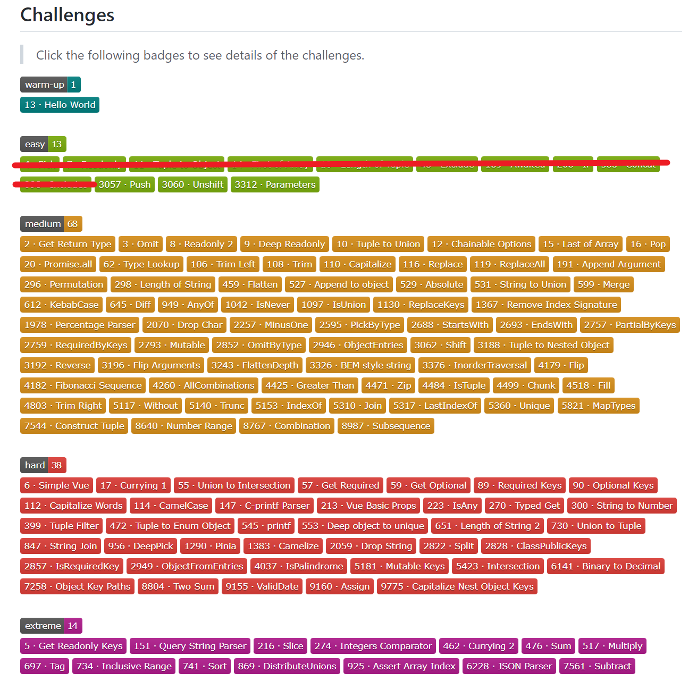

# TypeScript 大挑战（四）

这是 TypeScript 大挑战系列的第 4 篇，笔者计划用 6 个月时间完成 [type-challenges](https://github.com/type-challenges/type-challenges "type-challenges") 项目中的 133 个挑战并记录下自己的收获，目前还剩余 123 个，截止日期为 2023 年 1 月25 日。




## 11. Push

### 挑战内容

在类型系统里实现通用的 `Array.push`：

``` typescript
// TODO: 实现 Push
type Push<T, U> = any

// Result 为 [1, 2, '3']
type Result = Push<[1, 2], '3'>
```

> 知识点：`infer`

### 题目解析

这个题目和 TypeScript 大挑战（三）中的 `9. Concat` 基本一样，这里就不多说了，关键在于通过 `...T` 展开数组。

### 题目答案

``` typescript
type Push<T extends any[], U> = [...T, U]
```

## 12. Unshift 

### 挑战内容

在类型系统里实现通用的 `Array.unshift`：

``` typescript
// TODO: 实现 Unshift
type Unshift<T, U> = any

// Result 为 [0, 1, 2]
type Result = Unshift<[1, 2], 0>
```

> 知识点：`infer`

### 题目解析

这一题和 `11. Push` 类似，非常简单，关键也在于通过 `...T` 展开数组。

### 题目答案

``` typescript
type Unshift<T extends any[], U> = [U, ...T]
```

## 13. Parameters

### 挑战内容

实现内置的 `Parameters` 类型，以数组的形式返回函数的全部参数类型，可参考[TypeScript官方文档](https://www.typescriptlang.org/docs/handbook/utility-types.html#parameterstype "TypeScript官方文档")：

``` typescript
// TODO: 实现 MyParameters
type MyParameters<
  T extends (...args: any[]) => any
> = any

const foo = (
  arg1: string,
  arg2: number,
): void=> {}

// ParamsType 为  [string, number]
// 即 foo 的参数类型
type ParamsType= MyParameters<typeof foo>
```

> 知识点：`infer`

### 题目解析

现在看到这种获取传入参数类型的题目，大家应该都很熟悉了，第一反应就是需要使用 `infer`，从而实现自动推断出类型的能力。

比较困难的点可能是之前没有接触过对于函数，如何使用 `infer`。这里我们先看一个简单的例子*取出函数第二个参数的类型*：

``` typescript
type SecondParameter<
  T extends (...args: any[]) => any
> = T extends (first: any, second: infer Second) => any
    ? Second : never
    
const foo = (x: string, y: number): void => {}

// Second 为 number
type Second = SecondParameter<typeof foo>
```

其实也很简单，就如同正常函数的参数类型声明，只不过把具体的类型 `any / number` 等，换成了 `infer Second` 的形式，从而使用推断能力。

### 题目答案

``` typescript
type MyParameters<
  T extends (...args: any[]) => any
> = T extends (...args: infer K) => any
    ? K : never
```

## 结语

通过 TypeScript 大挑战（一）~（四），我们已经完成了全部 13 道 Easy 级别的题目，这一期的三个题目明显做起来快了很多，也许这就是熟能生巧吧 👏👏

最后总结下这段时间挑战的收获：

1. `keyof` 获取对象全部键名的联合类型（union）。
2. `in` 取联合类型可能的值。
3. `readonly` 和 `const` 的异同。
4. 元组类型（tuple）的使用。
5. 在 `X extends Y` 的条件类型语句中，若 `X` 是联合类型的范型，则会将联合类型的每一个可能的值代入进行独立计算，再将结果通过 `|` 组合起来。
6. 通过递归调用处理嵌套。
7. `infer` 在 `extends` 中的推断功能。