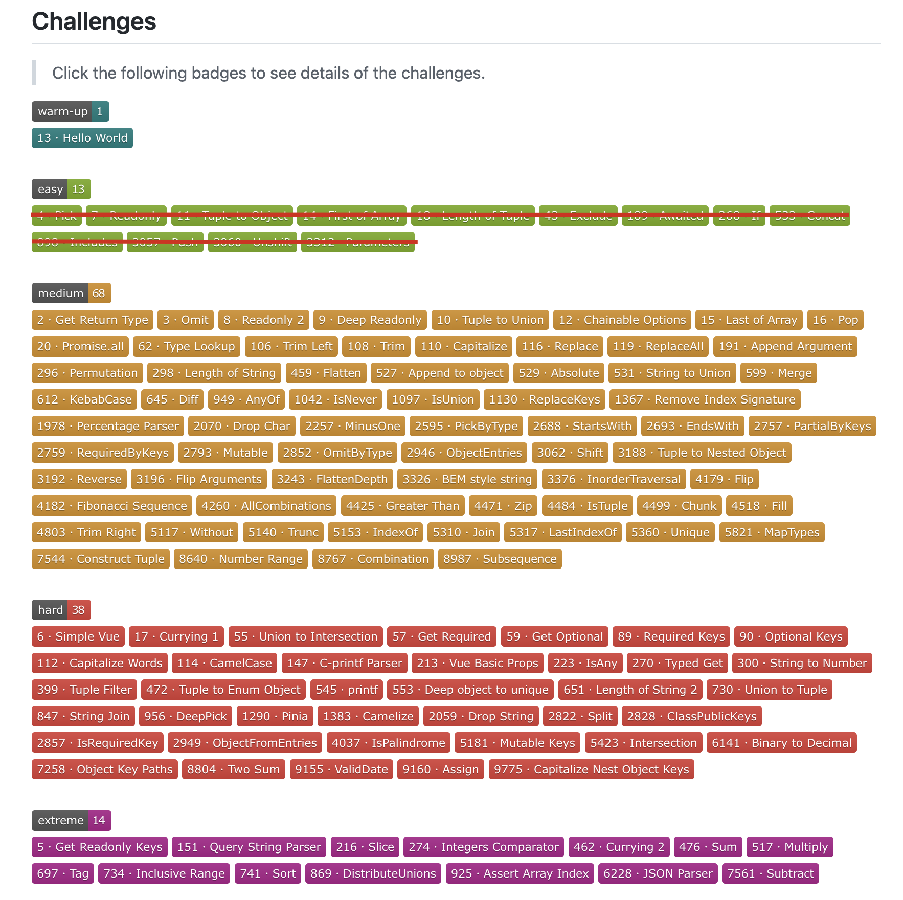

# TypeScript 大挑战（五）

这是 TypeScript 大挑战系列的第 5 篇，笔者计划用 6 个月时间完成 [type-challenges](https://github.com/type-challenges/type-challenges "type-challenges") 项目中的 133 个挑战并记录下自己的收获，目前还剩余 120 个，截止日期为 2023 年 1 月25 日。



## 14. 获取函数返回类型

### 挑战内容

实现 TypeScript 内置的 `ReturnType<T>`，用于获取函数返回结果的类型，例如：

``` typescript
// TODO: 实现 MyReturnType
type MyReturnType<T> = any

const fn = (v: boolean) => {
  if (v)
    return 1
  else
    return 2
}

//  A 类型为 "1 | 2"
type A = MyReturnType<typeof fn>
```

> 知识点：`infer`

### 题目解析

虽然说这是 medium 难度的第一题，但是其实和 TypeScript 大挑战（四）中 easy 难度的最后一题 `13. Parameters` 基本一致，思路也是通过使用 `infer`，实现自动推断出类型的能力。

### 题目答案

``` typescript
type MyReturnType<T>
  = T extends (...args: any) => infer K
    ? K : never
```

## 15. 实现 Omit

### 挑战内容

实现 TypeScript 内置的 `Omit<T, K>` 泛型。

`Omit` 会创建一个省略 `K` 中字段的 `T` 对象，例如：

``` typescript
// TODO: 实现 MyOmit
type MyOmit<T, K> = any

interface Todo {
  title: string
  description: string
  completed: boolean
}

// TodoPreview: { completed: boolean }
type TodoPreview = MyOmit<
  Todo,
  'description' | 'title'
>
```

> 知识点： `in / keyof / infer`

### 题目解析

这道题的关键在于如何得到 `T` 所有字段减去 `K` 中字段的结果，而这个功能恰恰是我们在 TypeScript 大挑战（二）中所实现的 `6. Exclude`：

``` typescript
// Result 为 'b' | 'c'
type Result = Exclude<
  'a' | 'b' | 'c' | 'd', 
  'a' | 'd'
>
```

通过 `keyof T` 获取到 `T` 的所有字段，再通过 `Exclude<keyof T, K>` 既可以得到想要的字段。

### 题目答案

``` typescript
type MyOmit<T, K extends keyof T> = {
  [P in Exclude<keyof T, K>]: T[P]
}
```

## 16. Readonly 2

### 挑战内容

实现一个通用 `MyReadonly2<T, K>`，它带有两种类型的参数 `T` 和 `K`：
  - 若指定 `K`，则设置 `T` 对应的属性集为 readonly。
  - 若未指定 `K`，则应使 `T` 所有属性都变为 readonly。

``` typescript
// TODO: 实现 MyReadonly2
type MyReadonly2<T, K> = any

interface Todo {
  title: string
  description: string
  completed: boolean
}

const todo: MyReadonly2<Todo, 'title' | 'description'> = {
  title: "Hey",
  description: "foobar",
  completed: false,
}

// 错误，不能修改只读的 titile
todo.title = "Hello"
// 错误，不能修改只读的 description
todo.description = "barFoo"
// 没问题
todo.completed = true
```

> 知识点：`keyof / 范型默认值 / Omit`

### 题目解析

在 `K` 没有传值的时候，需要将 `T` 所有属性都变为 readonly，也就是说需要给 `K` 一个默认值，这点是我们之前没有触过的。

为了给范型一个默认值，需要使用 `K extends xxx = yyy` 的形式，其中 `yyy` 即为默认值：

``` typescript
// 设置 K 的默认值为 T 的所有属性
type MyReadonly2<
  T,
  K extends keyof T = keyof T
> = ...
```

除此之外，还需要将 `T` 的属性分为两部分：在 `K` 中的属性设置为 readonly，不在 `K` 中的属性保持原样：

``` typescript
// K 中的属性设置为 readonly
type A<
  T,
  K extends keyof T = keyof T
> = {
  readonly [Key in K]: T[K]
}

// 不在 K 中的属性保持原样
type B<
  T,
  K extends keyof T = keyof T
> = Omit<A, K>
```

最后将 `A` 和 `B` 类型通过 `&` 组装起来即可。

### 题目答案

``` typescript
type MyReadonly2<
  T,
  K extends keyof T = keyof T
> = {
  readonly [Key in K]: T[Key]
} & Omit<T, K>
```

## 17. 深度 Readonly

### 挑战内容

实现一个通用的 `DeepReadonly<T>`，它将对象的每个参数及其子对象递归地设为 readonly，例如：
  
``` typescript
// TODO: 实现 DeepReadonly
type DeepReadonly<T> = any

type X = {
  x: { 
    a: 1
    b: 'hi'
  }
  y: 'hey'
}

type Expected = { 
  readonly x: { 
    readonly a: 1
    readonly b: 'hi'
  }
  readonly y: 'hey' 
}

// Todo 的类型和 Expected 一样
type Todo = DeepReadonly<X>
```

> 知识点：递归调用 / 函数判断

### 题目解析

对于这种嵌套类型的问题，我们在 TypeScript 大挑战（三） `7.Awaited` 中已经接触过，主要是通过递归调用的方式来处理。

首先搭建基本的框架：

``` typescript
type DeepReadonly<T> = {
  readonly [K in keyof T]:
    (判断条件) ? DeepReadonly<T[K]> : T[K]
}
```

接下来的关键则是判断条件的确定：对于对象，需要递归调用 `DeepReadonly` 进行计算；对于普通数据类型，直接使用即可。

``` typescript
type DeepReadonly<T> = {
  readonly [K in keyof T]:
    K extends {} ? DeepReadonly<T[K]> : T[K]
}
```

不过这个答案还不算完美：`T[K]` 为函数时其实不需要再调用 `DeepReadonly` 了，所以可以再进一步优化：

``` typescript
type DeepReadonly<T> = {
  readonly [K in keyof T]:
    T[K] extends Function ? T[K]
      : K extends {} ? DeepReadonly<T[K]>
        : T[K]
}
```

### 题目答案

``` typescript
type DeepReadonly<T> = {
  readonly [K in keyof T]:
    T[K] extends Function ? T[K]
      : K extends {} ? DeepReadonly<T[K]>
        : T[K]
}
```

除了这种方法之外，还可以通过 `keyof T extends never` 的方式来过滤函数，对于函数而言，这个判断条件的结果为 false：

``` typescript
type DeepReadonly<T> =
  keyof T extends never ? T : {
      readonly [key in keyof T]:
        DeepReadonly<T[key]>
  }
```

## 结语

和 easy 难度的挑战相比，medium 难度的题目明显更加灵活了，有时候还需要借助 TypeScript 内置的工具类型来巧妙地解决问题，有意思 😛