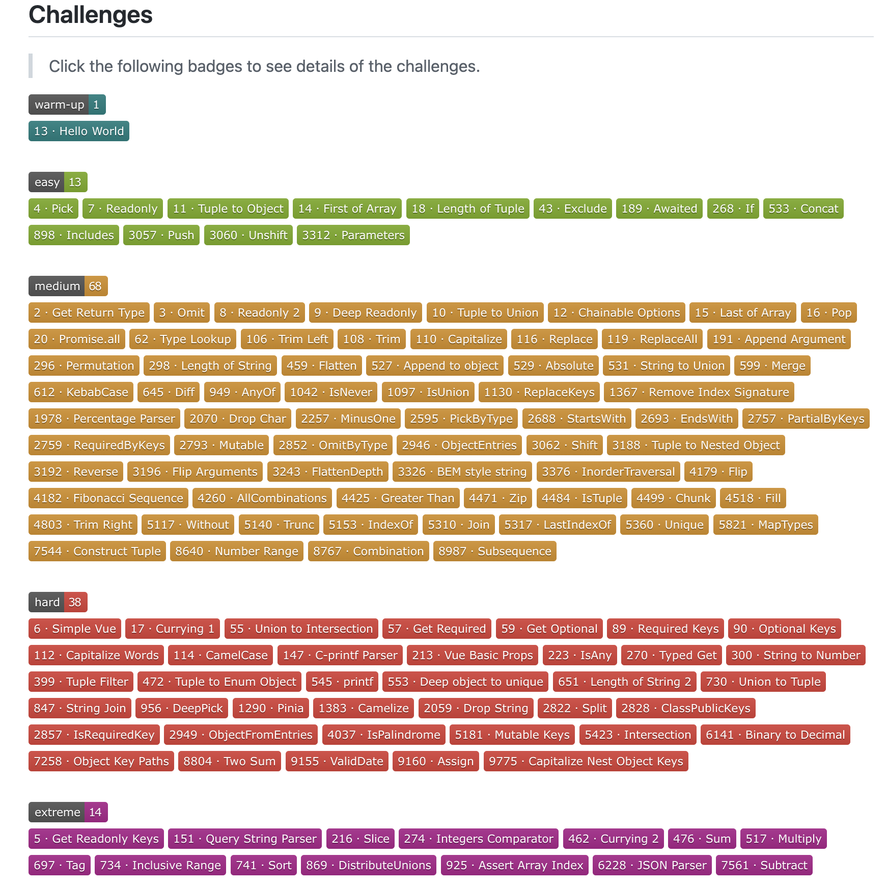

# 大挑战

最近在 Github 上发现了一个有趣的项目 [type-challenges](https://github.com/type-challenges/type-challenges "type-challenges")，它是 TypeScript 类型体操姿势合集，提供了常用的一百多个工具类型 playground，可以让我们像玩游戏一样进行通关大挑战。

其中有一些是 TypeScript 内置的工具类型，例如 [`Pick / Readonly / Exclude`](https://www.typescriptlang.org/docs/handbook/utility-types.html "`Pick / Readonly / Exclude`") 等，剩余绝大部分则是一些常用但未官方实现的，例如 `Deep Readonly / Trim / Capitalize` 等。

2022 年下半年的时候，我陆陆续续在微信公众号上更新了 [TypeScript 大挑战系列](https://mp.weixin.qq.com/mp/appmsgalbum?__biz=MzkzMTE5NzU3OA==&action=getalbum&album_id=2501006847047647233#wechat_redirect) 记录通关的过程，欢迎大家关注 🙂