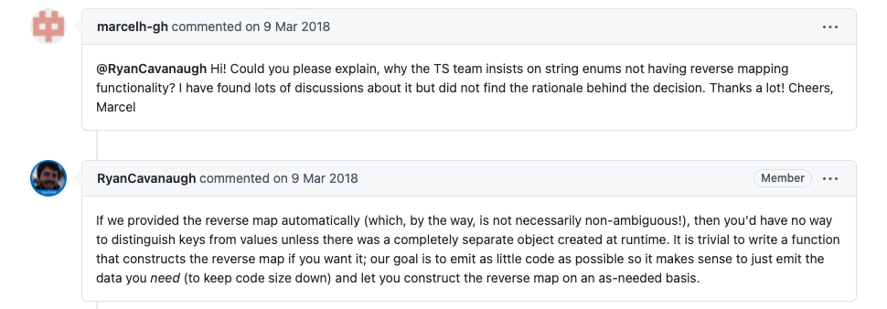

# 常见问题

## never 和 void 区别

这两者中文都有空的意思，而且往往都用来标示函数的返回值类型，不过实际的含义差别很大。

函数返回值类型为 `void` 时，表示返回值可以是 `null`（当没有开启 --strictNullChecks 编译选项）或者`undefined`（没有 `return` 语句时返回值也为 `undefined`）。

``` ts
function warnUser1(): void {
  console.log("This is my warning message");
}

function warnUser2(): void {
  console.log("This is my warning message");
  return undefined;
}

function warnUser3(): void {
  console.log("This is my warning message");
  return null;
}
```

函数返回值类型为 `never` 时，表示函数永远不会正常返回，例如一定抛出异常或者陷入死循环中。

``` ts
function error(message: string): never {
  throw new Error(message); 
}

function infiniteLoop(): never {
  while (true) {}
}

```

## Number Enum 和 String Enum 有什么区别？

Number Enum 和 String Enum 分别指的是值为 number 类型和值为 string 类型的枚举，例如：

``` ts
// Direction_A 是 String Enum
enum Direction_A {
  Up = 1,
  Down,
  Left,
  Right,
}

// Direction_B 是 Number Enum
enum Direction_B {
  Up = "UP",
  Down = "DOWN",
  Left = "LEFT",
  Right = "RIGHT",
}
```

两者的关键区别在 **Number Enum 会做反向映射（reverse mappings），而 String Enum 则不会**，例如对于下面的代码：

``` ts{7,8}
// 一个 Number Enum
enum Enum_Test {
  A,
}

let a = Enum_Test.A;
// 注意只能对 Number Enum 进行这种使用获得其名称
let nameOfA = Enum_Test[a]; // "A"
```

它会被翻译成如下的 js 代码：

``` js{3-5}
"use strict";
var Enum_Test;
(function (Enum_Test) {
    Enum_Test[Enum_Test["A"] = 0] = "A";
})(Enum_Test || (Enum_Test = {}));
let a = Enum_Test.A;

let nameOfA = Enum_Test[a]; // "A"
```

也就是说会创建一个 Enum_Test 的变量，值为 `{A: 0, "0": "A"}`，其中 `A` 和 `0` 互为 key-value，这就是所谓的反向映射。

不过对于 String Enum，并不会存在这样的行为，例如：

``` ts
// 一个 String Enum
enum Enum_Test {
  GREEN = 'Green',
}
```

他会被翻译成如下的 js 代码，其中 `Enum_Test['Green']` 的值为 `undefined`：

```js
"use strict";
var Enum_Test;
(function (Enum_Test) {
    Enum_Test["GREEN"] = "Green";
})(Enum_Test || (Enum_Test = {}));
```

至于为什么 String Enum 不像 Number Enum 一样做方向映射呢？从 TypeScript 的开发人员在 [Github 上的回复](https://github.com/Microsoft/TypeScript/issues/21935#issuecomment-371583528) 来看主要是有三点原因：

- 如果 String Enum 也做了反向映射的话，无法一眼区分出 key 和 value（因为都是类似的字符串）
- 希望生成的代码足够简洁，所以不做转换
- 如果的确需要的话，开发者自己做一次转换也很容易



## Const Enum 和普通的 Enum 有什么区别？

在上文中已经看到 Enum 被翻译成 js 代码后，是会有相对应的对象变量的。而对于 Const Enum 而言，会在编译时直接进行值的替换，仅能从注释中看出是从 Enum 元素：

``` ts
const enum Enum_Test {
  GREEN = 'Green',
}

console.log(Enum_Test.GREEN);
```

这段代码编译后会完全丧失 `Enum_Test` 变量：

```js
"use strict";
console.log("Green" /* GREEN */);
```

## compilerOptions 配置

### moduleResolution

TypeScript 提供两种模块解析的策略：

- `Classic`: 默认的策略，主要是为向后兼容，不会在 `node_modules` 中去寻找模块。
- `Node`: 模仿 Node.js 模块解析机制，一般来说指定为此值即可。


<Vssue title="TypeScript 常见问题" />
